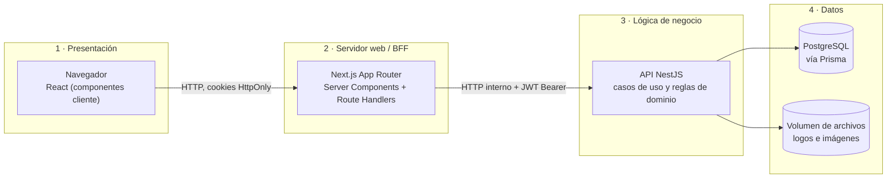
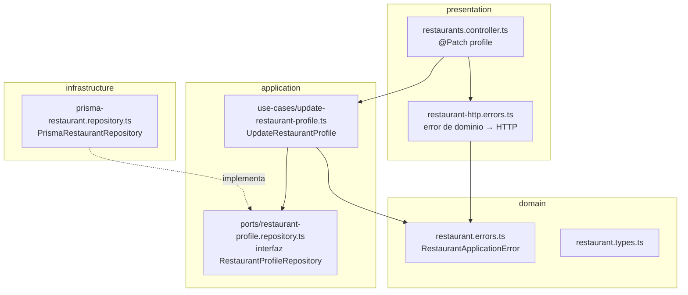
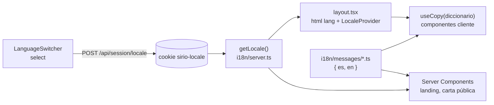
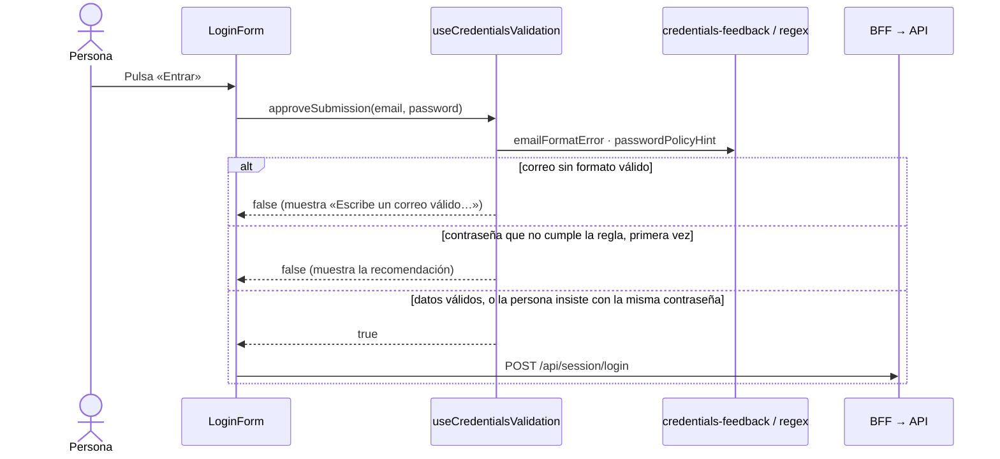

# Checklist académico — Sistema de Cartas QR

Este documento muestra dónde cumple el proyecto cada uno de los cinco requisitos del checklist. Cada punto cita el archivo y la línea exacta, e indica cómo verificarlo con las pruebas del repositorio. Las rutas son relativas a la raíz del repositorio.

| # | Requisito | Dónde se cumple |
|---|---|---|
| 1 | Arquitectura en n capas | Sistema en 4 capas (navegador → Next.js BFF → API NestJS → PostgreSQL) y, dentro de la API, cada módulo en `domain` / `application` / `infrastructure` / `presentation` |
| 2 | Dos componentes *stateful* | [`LoginForm`](../apps/web/src/app/login/login-form.tsx#L15) y [`PasswordField`](../apps/web/src/components/password-field.tsx#L20) |
| 3 | Dos componentes *stateless* | [`Card`](../apps/web/src/components/surfaces.tsx#L20) y [`StatusPill`](../apps/web/src/components/surfaces.tsx#L77) |
| 4 | Menú desplegable de idioma | [`LanguageSwitcher`](../apps/web/src/components/language-switcher.tsx#L24): español e inglés en toda la aplicación |
| 5 | Formulario validado con expresiones regulares | Los dos formularios de acceso, con [`EMAIL_PATTERN` y `PASSWORD_POLICY_PATTERN`](../packages/shared/src/credentials-policy.ts#L1) |

---

## 1. Arquitectura en n capas

La arquitectura tiene capas en dos niveles: el sistema completo y cada módulo de la API.

### 1.1 Capas del sistema

El navegador nunca habla directamente con la API ni con la base de datos. Cada petición atraviesa las capas en orden y cada capa solo conoce a la siguiente.



| Capa | Responsabilidad | Código |
|---|---|---|
| Presentación | Pantallas y formularios que ve la persona | [`apps/web/src/app`](../apps/web/src/app), [`apps/web/src/components`](../apps/web/src/components) |
| Servidor web / BFF | Guarda la sesión en cookies, valida el origen y reenvía a la API con el rol correcto | [`apps/web/src/app/api`](../apps/web/src/app/api), [`apps/web/src/lib/api-server.ts`](../apps/web/src/lib/api-server.ts) |
| Lógica de negocio | Casos de uso, validaciones de dominio y autorización | [`apps/api/src`](../apps/api/src) |
| Datos | Persistencia relacional y archivos | [`prisma/schema.prisma`](../prisma/schema.prisma), adaptadores en `apps/api/src/*/infrastructure` |

Un ejemplo concreto es la ruta que guarda el perfil de un restaurante, [`app/api/owner/restaurants/[restaurantId]/profile/route.ts:23`](../apps/web/src/app/api/owner/restaurants/[restaurantId]/profile/route.ts#L23). Primero valida el origen de la petición (`isSameOrigin`, línea 27). Después reenvía a la API con la sesión del dueño (`authenticatedApiFetch`, línea 36) y devuelve la respuesta sin exponer los tokens al navegador (`proxyApiResponse`, línea 35).

### 1.2 Capas dentro de cada módulo de la API

Cada módulo de NestJS (`auth`, `restaurants`, `digitization`, `menu-management`, `analytics`) repite la misma partición en capas, con arquitectura hexagonal. Las dependencias apuntan siempre hacia el dominio: `domain` no importa nada de NestJS ni de Prisma.



Recorrido de «actualizar el perfil» en el módulo [`restaurants`](../apps/api/src/restaurants):

| Capa | Archivo | Qué hace |
|---|---|---|
| presentation | [`restaurants.controller.ts:132`](../apps/api/src/restaurants/restaurants.controller.ts#L132) | Recibe el `PATCH`, valida el DTO y llama al caso de uso; traduce los errores con `throwRestaurantHttpError` (línea 149) |
| application | [`use-cases/update-restaurant-profile.ts:22`](../apps/api/src/restaurants/application/use-cases/update-restaurant-profile.ts#L22) | Clase sin decoradores de NestJS que aplica las reglas y depende solo de puertos |
| application (puerto) | [`ports/restaurant-profile.repository.ts:13`](../apps/api/src/restaurants/application/ports/restaurant-profile.repository.ts#L13) | Interfaz de lo que el caso de uso necesita de la persistencia |
| domain | [`domain/restaurant.errors.ts:13`](../apps/api/src/restaurants/domain/restaurant.errors.ts#L13) | Errores y tipos de negocio, sin dependencias de framework |
| infrastructure | [`infrastructure/prisma-restaurant.repository.ts:37`](../apps/api/src/restaurants/infrastructure/prisma-restaurant.repository.ts#L37) | Implementa el puerto con Prisma y PostgreSQL |

Las capas se conectan en [`restaurants.module.ts:164`](../apps/api/src/restaurants/restaurants.module.ts#L164): el módulo inyecta el repositorio de Prisma en el caso de uso mediante `useFactory`. Gracias a eso las pruebas unitarias crean el caso de uso con un repositorio simulado, sin levantar NestJS.

---

## 2. Dos componentes *stateful*

Un componente es *stateful* cuando guarda estado propio que cambia con la interacción, en React con `useState`, y ese estado decide lo que se muestra.

### 2.1 `LoginForm` — formulario de acceso del administrador

[`apps/web/src/app/login/login-form.tsx:15`](../apps/web/src/app/login/login-form.tsx#L15)

```tsx
export function LoginForm() {
  const router = useRouter();
  const copy = useCopy(loginCopy);
  const [failure, setFailure] = useState<LoginFailure | null>(null);
  const [submitting, setSubmitting] = useState(false);
```

- `failure` recuerda si el último intento falló por credenciales erróneas o por un fallo del servicio, y muestra el mensaje correspondiente.
- `submitting` desactiva el botón y cambia su texto a «Ingresando…» mientras la petición está en curso.

[`OwnerLoginForm`](../apps/web/src/app/admin/login/owner-login-form.tsx#L15), el acceso del dueño, sigue el mismo patrón.

### 2.2 `PasswordField` — campo de contraseña con botón «Mostrar»

[`apps/web/src/components/password-field.tsx:20`](../apps/web/src/components/password-field.tsx#L20)

```tsx
const [revealed, setRevealed] = useState(false);            // línea 33
// …
type={revealed ? 'text' : 'password'}                        // línea 47
// …
onClick={() => setRevealed((current) => !current)}
```

`revealed` alterna entre ocultar y mostrar la contraseña escrita. El mismo estado cambia el tipo del `<input>`, el texto del botón («Mostrar» / «Ocultar») y su `aria-pressed`.

**Verificación:** [`login-form.test.tsx`](../apps/web/src/app/login/login-form.test.tsx) y [`owner-login-form.test.tsx`](../apps/web/src/app/admin/login/owner-login-form.test.tsx) cubren los estados de error y la acción de mostrar y ocultar.

---

## 3. Dos componentes *stateless*

Un componente es *stateless* cuando no guarda estado: con las mismas *props* dibuja siempre lo mismo. No usa `useState` ni efectos.

### 3.1 `Card` — superficie de los paneles

[`apps/web/src/components/surfaces.tsx:20`](../apps/web/src/components/surfaces.tsx#L20)

```tsx
export function Card({ accent, children, className }: CardProps) {
  return (
    <div
      className={cn(
        'rounded-2xl bg-paper shadow-soft',
        accent && ACCENT_BORDERS[accent],
        className,
      )}
    >
      {children}
    </div>
  );
}
```

Transforma sus props (`accent`, `className`, `children`) en marcado, sin guardar ni modificar nada.

### 3.2 `StatusPill` — etiqueta de estado

[`apps/web/src/components/surfaces.tsx:77`](../apps/web/src/components/surfaces.tsx#L77)

```tsx
export function StatusPill({ children, tone }: { children: ReactNode; tone: 'draft' | 'muted' | 'positive' }) {
  const tones = {
    draft: 'bg-copper-wash text-copper',
    muted: 'bg-control text-ink-muted',
    positive: 'bg-olive-wash text-olive',
  };
  return (
    <span className={cn('inline-flex items-center … rounded-full …', tones[tone])}>
      <span aria-hidden="true" className="size-1.5 rounded-full bg-current" />
      {children}
    </span>
  );
}
```

Traduce el tono recibido a colores. Se usa, por ejemplo, para «Habilitado» / «Deshabilitado» en el backoffice y «Borrador» / «En vivo» en la carta. En el mismo archivo hay otros componentes sin estado: `Kicker`, `ErrorBanner`, `Skeleton` y `NumberedHeading`.

---

## 4. Menú desplegable de selección de idioma

### 4.1 El componente

[`apps/web/src/components/language-switcher.tsx:24`](../apps/web/src/components/language-switcher.tsx#L24)

- **Menú desplegable real:** un `<select>` nativo (línea 57) con una opción por idioma (línea 68). Cada idioma aparece escrito en sí mismo («Español», «English») y lleva su atributo `lang`. Al ser nativo, el teclado, los lectores de pantalla y el selector del teléfono funcionan sin código extra.
- **Guardar la elección:** al cambiar de opción, el componente envía `POST /api/session/locale`. Esa ruta ([`route.ts:12`](../apps/web/src/app/api/session/locale/route.ts#L12)) valida el origen y escribe la cookie `sirio-locale` (línea 27). Luego `router.refresh()` vuelve a pintar la página en el idioma nuevo sin perder lo que la persona ya escribió en formularios.
- **Dónde aparece:** en la landing ([`app/page.tsx:40`](../apps/web/src/app/page.tsx#L40)), en los dos accesos ([`login-shell.tsx:40`](../apps/web/src/components/login-shell.tsx#L40)) y en la navegación del panel del dueño y del backoffice ([`side-rail.tsx:61`](../apps/web/src/components/side-rail.tsx#L61)).

### 4.2 Cómo se traduce la aplicación



| Pieza | Código |
|---|---|
| Lectura del idioma en el servidor | [`i18n/server.ts:9`](../apps/web/src/i18n/server.ts#L9) |
| `<html lang>` según el idioma | [`app/layout.tsx:34`](../apps/web/src/app/layout.tsx#L34) |
| Contexto para los componentes cliente | [`i18n/locale-provider.tsx:12`](../apps/web/src/i18n/locale-provider.tsx#L12) y `useCopy` en la línea 21 |
| Diccionarios tipados `{ es, en }` | [`apps/web/src/i18n/messages`](../apps/web/src/i18n/messages): landing, accesos, panel del dueño, backoffice, carta pública y errores de la API |
| Formato de moneda, números y fechas | [`i18n/format.ts`](../apps/web/src/i18n/format.ts): `S/ 32.00` en español y `PEN 32.00` en inglés |

La traducción cubre toda la interfaz. Los errores de la API llegan con un código y se traducen en el navegador. El contenido que escribe el dueño (nombre del restaurante, platos, descripciones, dirección) nunca se traduce.

**Verificación:**
- [`i18n/messages.test.ts`](../apps/web/src/i18n/messages.test.ts) comprueba que cada diccionario tiene las mismas entradas en ambos idiomas y que ninguna quedó sin traducir.
- Los E2E [`i18n-switch.spec.ts`](../tests/e2e/i18n-switch.spec.ts), [`i18n-owner-panel.spec.ts`](../tests/e2e/i18n-owner-panel.spec.ts), [`i18n-backoffice.spec.ts`](../tests/e2e/i18n-backoffice.spec.ts), [`i18n-public-menu.spec.ts`](../tests/e2e/i18n-public-menu.spec.ts) e [`i18n-api-errors.spec.ts`](../tests/e2e/i18n-api-errors.spec.ts) recorren cada superficie en inglés, en escritorio, Android e iPhone.

---

## 5. Formulario validado con expresiones regulares

### 5.1 Las expresiones regulares

[`packages/shared/src/credentials-policy.ts`](../packages/shared/src/credentials-policy.ts#L1)

```ts
const EMAIL_PATTERN = /^[^\s@]+@[^\s@]+\.[^\s@]+$/;                      // línea 1
const PASSWORD_POLICY_PATTERN = /^(?=.*\p{Ll})(?=.*\p{Lu})(?=.*\p{Nd})/su; // línea 5
```

| Expresión | Significado |
|---|---|
| `^[^\s@]+` | Una o más letras antes de la arroba, sin espacios ni otra `@` |
| `@[^\s@]+` | La arroba y el nombre del dominio |
| `\.[^\s@]+$` | Un punto y la extensión del dominio (`.pe`, `.com`) hasta el final |
| `(?=.*\p{Ll})` | En algún punto hay una letra minúscula, incluidas `ñ`, `á` o `é` |
| `(?=.*\p{Lu})` | En algún punto hay una letra mayúscula, incluidas `Ñ` o `É` |
| `(?=.*\p{Nd})` | En algún punto hay un dígito |
| flags `s` y `u` | `u` activa las clases Unicode `\p{…}`; `s` deja que `.` también cruce saltos de línea |

`isValidEmailFormat` (línea 14) aplica la primera expresión. `meetsPasswordPolicy` (línea 26) aplica la segunda y exige además una longitud de entre 8 y 128 caracteres.

### 5.2 El formulario que las usa

Se validan los dos formularios de acceso: el del administrador ([`login-form.tsx`](../apps/web/src/app/login/login-form.tsx)) y el del dueño ([`owner-login-form.tsx`](../apps/web/src/app/admin/login/owner-login-form.tsx)).



1. [`login-form.tsx:28`](../apps/web/src/app/login/login-form.tsx#L28) llama a `approveSubmission` antes de enviar. El formulario usa `noValidate` (línea 52) para que la validación por regex sea la única fuente de mensajes.
2. [`use-credentials-validation.ts:50`](../apps/web/src/lib/use-credentials-validation.ts#L50) decide si se envía:
   - **Correo con formato inválido:** bloquea el envío.
   - **Contraseña que no cumple la regla:** muestra una advertencia la primera vez y permite continuar si la persona vuelve a pulsar. Así las cuentas creadas antes de la regla pueden seguir entrando.
3. [`credentials-feedback.ts:10`](../apps/web/src/lib/credentials-feedback.ts#L10) conecta las expresiones regulares con los mensajes, que llegan traducidos al idioma elegido.
4. La API usa las mismas funciones al fijar una contraseña, así que cliente y servidor nunca discrepan:
   - Alta de restaurante: [`restaurant.validation.ts:30`](../apps/api/src/restaurants/application/restaurant.validation.ts#L30) (correo) y la línea 48 (contraseña).
   - Cambio y reseteo: [`auth.utils.ts:24`](../apps/api/src/auth/application/auth.utils.ts#L24).

**Verificación:**
- [`packages/shared/tests/credentials-policy.test.ts`](../packages/shared/tests/credentials-policy.test.ts) prueba correos y contraseñas válidos e inválidos, incluidas letras con tilde.
- [`login-form.test.tsx`](../apps/web/src/app/login/login-form.test.tsx) y [`owner-login-form.test.tsx`](../apps/web/src/app/admin/login/owner-login-form.test.tsx) prueban el comportamiento del formulario.
- El E2E [`access-screens.spec.ts`](../tests/e2e/access-screens.spec.ts) prueba el formulario en un navegador real.

---

## Cómo ejecutar las pruebas

Desde la raíz del repositorio (requiere Node 24 y pnpm 11):

```powershell
pnpm install
pnpm --filter @sirio/shared test        # expresiones regulares
pnpm test                               # unitarias de API y web
pnpm compose:dev                        # levanta el stack con Docker
pnpm exec playwright test tests/e2e/access-screens.spec.ts tests/e2e/i18n-switch.spec.ts
```
