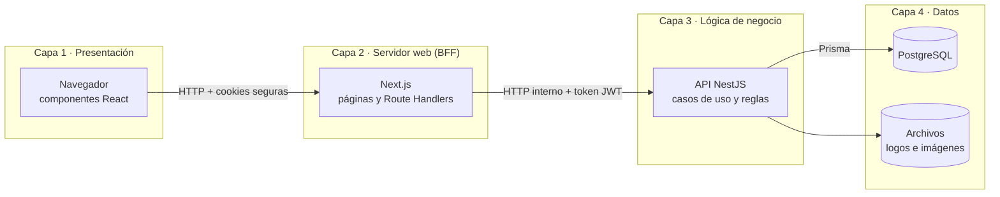
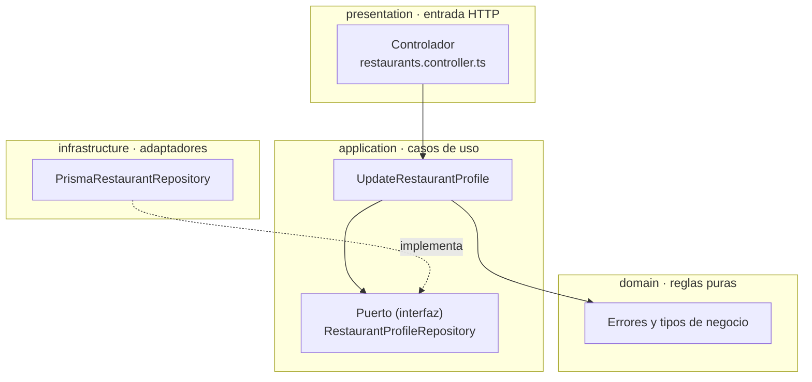
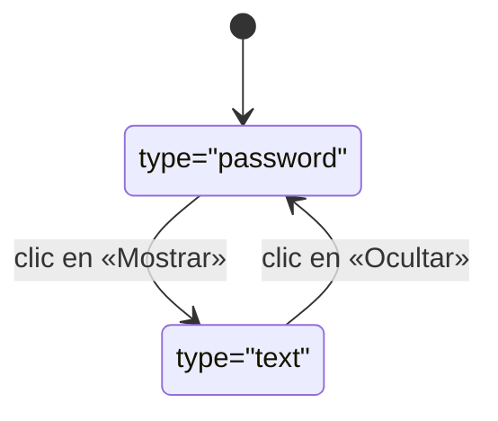
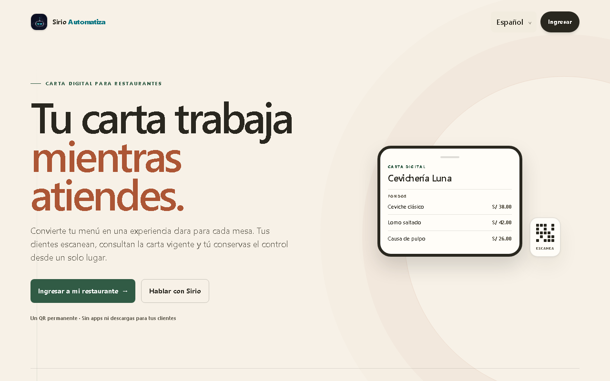
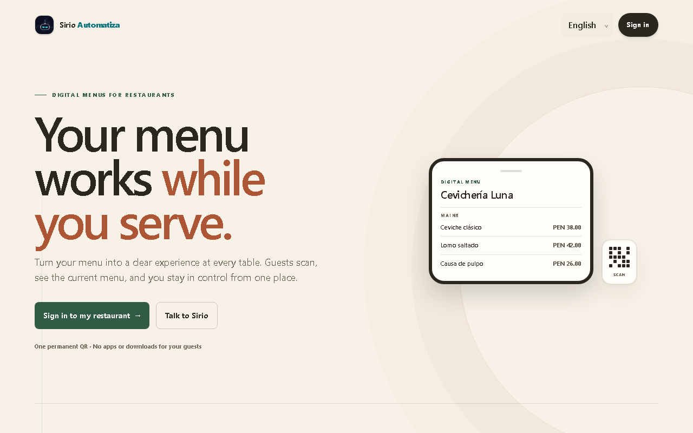
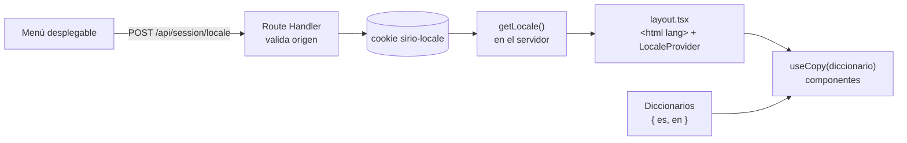
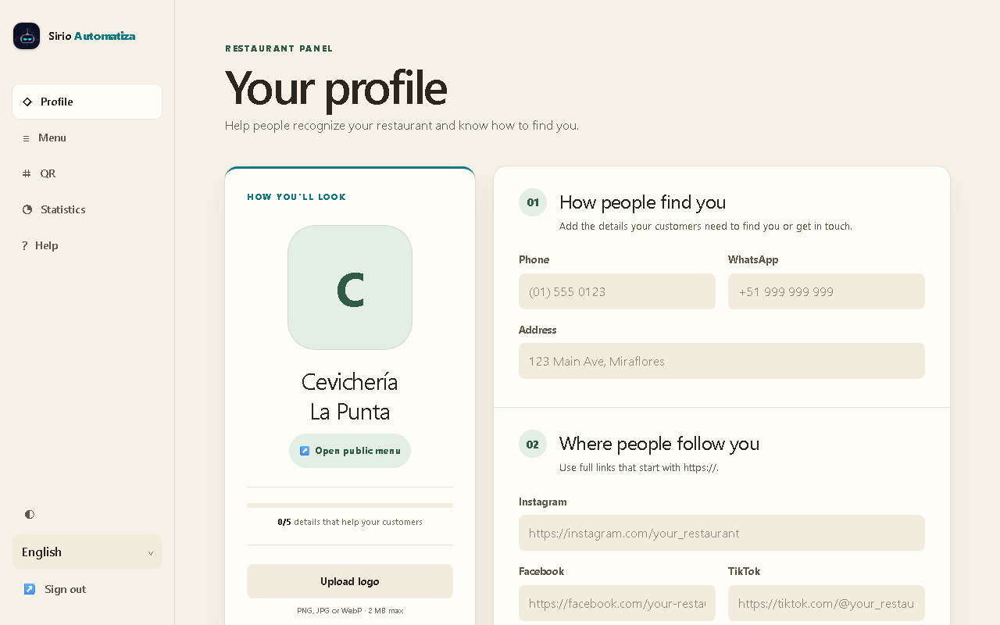
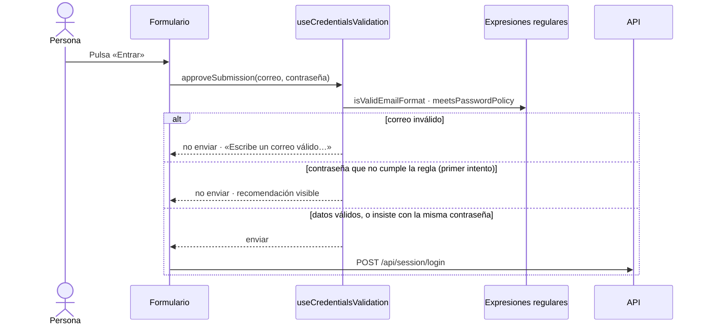
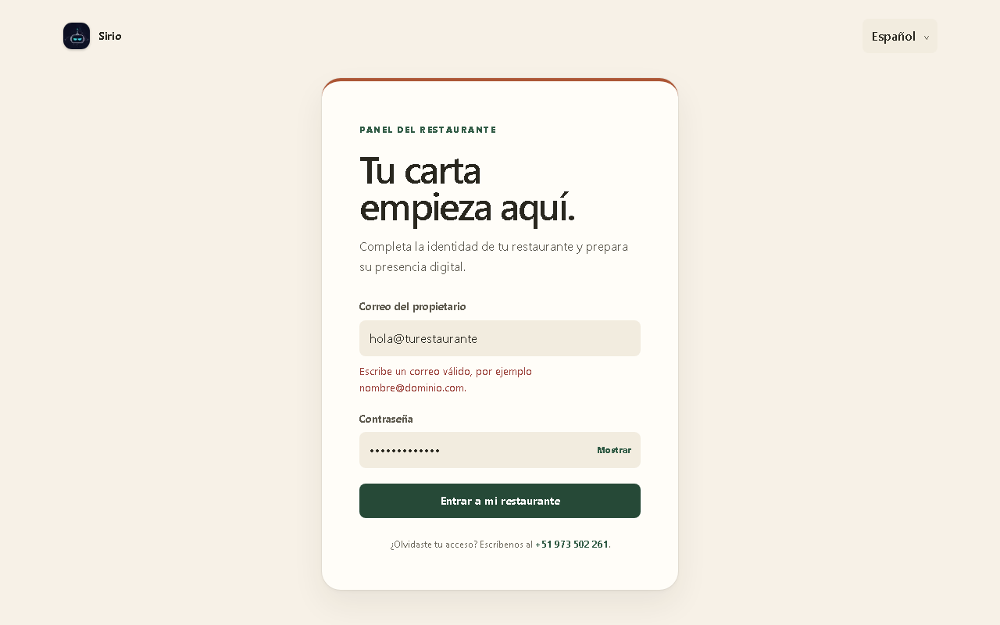
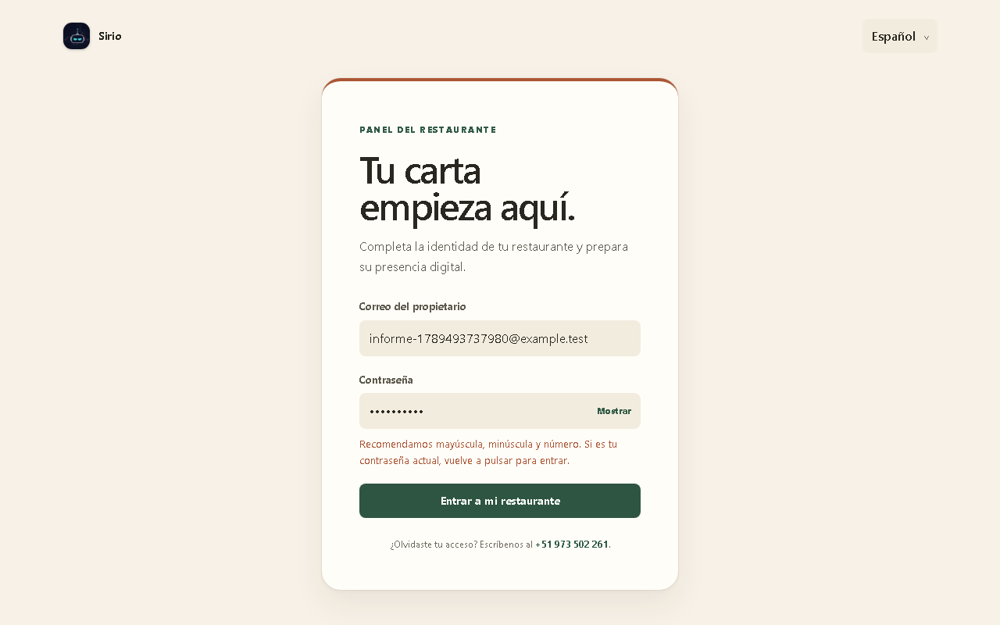

# Informe de implementación — Sistema de Cartas QR

|  |  |
|---|---|
| **Universidad** | [Completar] |
| **Facultad / Escuela** | [Completar] |
| **Curso** | [Completar] |
| **Docente** | [Completar] |
| **Integrantes** | [Completar] |
| **Fecha de entrega** | [Completar] |

---

## Índice

1. [Introducción](#1-introducción)
2. [Arquitectura en n capas](#2-arquitectura-en-n-capas)
3. [Componentes con estado (*stateful*)](#3-componentes-con-estado-stateful)
4. [Componentes sin estado (*stateless*)](#4-componentes-sin-estado-stateless)
5. [Internacionalización (i18n) con menú desplegable de idioma](#5-internacionalización-i18n-con-menú-desplegable-de-idioma)
6. [Validación de formularios con expresiones regulares](#6-validación-de-formularios-con-expresiones-regulares)
7. [Conclusiones](#7-conclusiones)

---

## 1. Introducción

**Sistema de Cartas QR** es una aplicación web para restaurantes. El dueño digitaliza su carta física a partir de fotos, la corrige, la publica y la comparte con un código QR que nunca cambia. El comensal escanea el QR desde su celular y ve la carta vigente.

El sistema atiende a tres audiencias:

| Audiencia | Superficie | Qué hace |
|---|---|---|
| Comensal | Carta pública `/{slug}` | Consulta platos, precios y datos de contacto |
| Dueño del restaurante | Panel `/admin` | Edita su perfil, gestiona la carta, descarga el QR y revisa estadísticas |
| Administrador de la plataforma | Backoffice `/backoffice` | Da de alta, pausa y elimina restaurantes |

Tecnologías principales:

| Parte | Tecnología |
|---|---|
| Interfaz y servidor web | Next.js 16 (App Router) con React 19 y Tailwind CSS 4 |
| API de negocio | NestJS 11 con TypeScript |
| Base de datos | PostgreSQL con Prisma 7 |
| Código compartido | Paquete `@sirio/shared` dentro del monorepo pnpm |
| Pruebas | Jest y Testing Library (unitarias), Playwright (extremo a extremo) |
| Despliegue | Docker Compose con Nginx |

Este informe explica cómo se implementaron cuatro requisitos del trabajo:

- la arquitectura en n capas;
- los componentes con y sin estado;
- la internacionalización con un menú desplegable de idioma;
- la validación de un formulario con expresiones regulares.

Las citas exactas de cada punto, con archivo y línea, están en el anexo [`checklist-academico.md`](checklist-academico.md).

---

## 2. Arquitectura en n capas

Una arquitectura en n capas separa el sistema en niveles con una responsabilidad única. Cada capa solo se comunica con la inmediata siguiente. En este proyecto la separación existe en dos niveles: el sistema completo y el interior de cada módulo de la API.

### 2.1 Capas del sistema



1. **Presentación.** Los componentes de React dibujan las pantallas y reciben lo que la persona escribe. No conocen la base de datos ni los tokens de sesión.
2. **Servidor web o BFF (*Backend for Frontend*).** Next.js cumple dos funciones:
   - Genera las páginas en el servidor.
   - Actúa como intermediario entre el navegador y la API. Los tokens de sesión viven en cookies `HttpOnly`, que el código del navegador no puede leer. Cada petición que modifica datos verifica que venga del propio sitio antes de reenviarla a la API con el token del usuario.
3. **Lógica de negocio.** La API de NestJS aplica las reglas del dominio: quién puede editar qué restaurante, cómo se valida un precio o cuándo se publica una carta.
4. **Datos.** PostgreSQL guarda restaurantes, cartas y estadísticas, y un volumen de archivos guarda logos e imágenes.

La consecuencia más importante es de seguridad: **el navegador nunca habla con la API ni con la base de datos**. Por ejemplo, guardar el perfil de un restaurante pasa por este *Route Handler* del BFF:

```ts
// apps/web/src/app/api/owner/restaurants/[restaurantId]/profile/route.ts
export async function PATCH(request: Request, context: { params: Promise<{ restaurantId: string }> }) {
  if (!isSameOrigin(request)) {
    return invalidOriginResponse();                 // rechaza peticiones de otros sitios
  }
  const { restaurantId } = await context.params;
  // …
  return proxyApiResponse(
    await authenticatedApiFetch(                    // añade el token de la cookie
      `/api/owner/restaurants/${encodeURIComponent(restaurantId)}/profile`,
      { body: await request.arrayBuffer(), headers: { 'content-type': contentType }, method: 'PATCH' },
      'OWNER',                                      // exige el rol de dueño
    ),
  );
}
```

### 2.2 Capas dentro de la API

Dentro de la capa de lógica de negocio, cada módulo de la API repite cuatro subcapas: `auth`, `restaurants`, `digitization`, `menu-management` y `analytics`. Siguen el estilo de **arquitectura hexagonal**, también llamada de puertos y adaptadores.



| Subcapa | Responsabilidad | Depende de |
|---|---|---|
| `domain` | Tipos, errores y reglas de negocio | Nada: no importa NestJS ni Prisma |
| `application` | Casos de uso y **puertos**, las interfaces de lo que necesitan | Solo de `domain` |
| `infrastructure` | **Adaptadores** concretos: Prisma, sistema de archivos, Gemini, generador de QR | Implementa los puertos |
| `presentation` | Controladores HTTP, validación de la forma de las peticiones y traducción de errores a códigos HTTP | Llama a los casos de uso |

La regla central es que **las dependencias apuntan hacia el dominio**. Un caso de uso no sabe que existe Prisma: recibe por su constructor un objeto que cumple la interfaz del puerto.

```ts
// application/ports/restaurant-profile.repository.ts — el puerto
export interface RestaurantProfileRepository {
  findProfileForOwner(ownerId: string, restaurantId: string): Promise<RestaurantProfile | null>;
  updateProfileForOwner(ownerId: string, restaurantId: string, input: UpdateRestaurantProfileRecord): Promise<RestaurantProfile | null>;
}

// application/use-cases/update-restaurant-profile.ts — el caso de uso
export class UpdateRestaurantProfile {
  constructor(
    private readonly repository: RestaurantProfileRepository,  // cualquier implementación del puerto
    private readonly storage: RestaurantLogoStorage,
  ) {}
}
```

El módulo de NestJS es el único lugar que conoce las implementaciones concretas y las conecta:

```ts
// restaurants.module.ts
{
  inject: [RESTAURANT_PROFILE_REPOSITORY, RESTAURANT_LOGO_STORAGE],
  provide: UPDATE_RESTAURANT_PROFILE,
  useFactory: (repository: RestaurantProfileRepository, storage: RestaurantLogoStorage) =>
    new UpdateRestaurantProfile(repository, storage),
},
```

Esta separación trae tres ventajas concretas:

- **Pruebas unitarias rápidas:** un caso de uso se prueba con un repositorio simulado, sin base de datos ni servidor.
- **Reemplazo de piezas:** cambiar el almacenamiento local de archivos por uno en la nube solo exige un adaptador nuevo que cumpla el mismo puerto.
- **Errores coherentes:** el dominio lanza errores con un código propio, y una única pieza de `presentation` los convierte en respuestas HTTP con un código que la interfaz traduce (sección 5.5).

---

## 3. Componentes con estado (*stateful*)

En React, un componente es **con estado** cuando guarda información propia que cambia mientras la persona interactúa (con el *hook* `useState`) y esa información decide lo que se dibuja. Si el estado cambia, React vuelve a dibujar el componente.

### 3.1 `LoginForm` — formulario de acceso

Archivo: `apps/web/src/app/login/login-form.tsx`

```tsx
export function LoginForm() {
  const router = useRouter();
  const copy = useCopy(loginCopy);
  const [failure, setFailure] = useState<LoginFailure | null>(null);   // ¿por qué falló el último intento?
  const [submitting, setSubmitting] = useState(false);                 // ¿hay una petición en curso?
  const validation = useCredentialsValidation();                       // estado de la validación (sección 6)

  async function handleSubmit(event: FormEvent<HTMLFormElement>) {
    event.preventDefault();
    // …
    if (!validation.approveSubmission(email, password)) return;
    setSubmitting(true);
    setFailure(null);
    const response = await fetch('/api/session/login', { /* … */ });
    if (!response.ok) {
      const wrongCredentials = response.status === 400 || response.status === 401;
      setFailure(wrongCredentials ? 'invalidCredentials' : 'serviceUnavailable');
      setSubmitting(false);
      return;
    }
    router.replace('/backoffice');
  }
  // …
  <Button disabled={submitting} full type="submit">
    {submitting ? copy.submitting : copy.admin.submit}
  </Button>
}
```

- `submitting` pasa a `true` al enviar: el botón se desactiva y muestra «Ingresando…», lo que evita enviar dos veces.
- `failure` recuerda el tipo de error y muestra un mensaje distinto para credenciales incorrectas o para un fallo del servicio.

El formulario del dueño, `OwnerLoginForm`, sigue exactamente el mismo diseño.

### 3.2 `PasswordField` — campo de contraseña con «Mostrar»

Archivo: `apps/web/src/components/password-field.tsx`

```tsx
export function PasswordField({ error, hint, label, ...rest }) {
  const [revealed, setRevealed] = useState(false);

  return (
    <div className="relative">
      <input type={revealed ? 'text' : 'password'} {...rest} />
      <button aria-pressed={revealed} onClick={() => setRevealed((current) => !current)} type="button">
        {revealed ? copy.hide : copy.show}
      </button>
    </div>
  );
}
```

Un único estado, `revealed`, controla tres cosas a la vez: el tipo del campo (texto oculto o visible), el texto del botón («Mostrar» / «Ocultar») y el atributo `aria-pressed` que anuncian los lectores de pantalla.



---

## 4. Componentes sin estado (*stateless*)

Un componente es **sin estado** cuando no guarda información propia: es una función pura de sus *props*. Con las mismas entradas dibuja siempre lo mismo, no usa `useState` ni efectos y se puede reutilizar en cualquier pantalla sin sorpresas.

### 4.1 `Card` — superficie de los paneles

Archivo: `apps/web/src/components/surfaces.tsx`

```tsx
export function Card({ accent, children, className }: CardProps) {
  return (
    <div className={cn('rounded-2xl bg-paper shadow-soft', accent && ACCENT_BORDERS[accent], className)}>
      {children}
    </div>
  );
}
```

Recibe el contenido y un color de acento opcional, y devuelve la tarjeta con el estilo del sistema de diseño. La usan el perfil, la carta, el QR, las estadísticas y el backoffice.

### 4.2 `StatusPill` — etiqueta de estado

Archivo: `apps/web/src/components/surfaces.tsx`

```tsx
export function StatusPill({ children, tone }: { children: ReactNode; tone: 'draft' | 'muted' | 'positive' }) {
  const tones = {
    draft: 'bg-copper-wash text-copper',
    muted: 'bg-control text-ink-muted',
    positive: 'bg-olive-wash text-olive',
  };
  return (
    <span className={cn('inline-flex items-center gap-1.5 rounded-full px-2 py-1 text-[11px] font-bold', tones[tone])}>
      <span aria-hidden="true" className="size-1.5 rounded-full bg-current" />
      {children}
    </span>
  );
}
```

Convierte un tono en colores. Muestra, por ejemplo, «Habilitado» / «Deshabilitado» en el backoffice y «Borrador» / «En vivo» en la carta. No decide qué estado tiene el restaurante: solo lo representa.

### 4.3 Comparación

| | Con estado (`LoginForm`, `PasswordField`) | Sin estado (`Card`, `StatusPill`) |
|---|---|---|
| Guarda información propia | Sí, con `useState` | No |
| Salida | Depende de las props **y** de lo que ocurrió antes | Depende solo de las props |
| Responsabilidad | Coordina la interacción | Presenta información |
| Cómo se prueba | Simulando clics y peticiones | Renderizando con distintas props |

La combinación de ambos es intencional. Los componentes con estado son pocos y concentran la lógica de interacción; los componentes sin estado forman la mayor parte de la interfaz, son predecibles y dan coherencia visual.

---

## 5. Internacionalización (i18n) con menú desplegable de idioma

Toda la aplicación está disponible en **español** (idioma por defecto) e **inglés**. El idioma se elige desde un menú desplegable que aparece en la página de inicio, en las dos pantallas de acceso y en el menú lateral del panel y del backoffice.



*Figura 1. Página de inicio en español; el selector «Español» está junto a la marca.*



*Figura 2. La misma página tras elegir «English» en el menú desplegable.*

### 5.1 Decisiones de diseño

- **Sin dependencias externas.** Se implementó una capa propia y pequeña, con diccionarios de TypeScript, una cookie y un contexto de React, en lugar de una librería. Así se evita peso extra y se aprovecha el tipado del lenguaje.
- **Sin prefijo de idioma en la URL.** Las rutas como `/en/…` no sirven aquí, porque cada QR impreso apunta a una dirección fija `/{slug}` que no puede cambiar. El idioma se guarda en la cookie de sesión `sirio-locale`.
- **El contenido del dueño nunca se traduce.** Nombre del restaurante, platos, descripciones y dirección se muestran tal como el dueño los escribió. Solo se traduce la interfaz fija.

### 5.2 El menú desplegable

Archivo: `apps/web/src/components/language-switcher.tsx`

```tsx
const LANGUAGE_NAMES: Record<Locale, string> = { en: 'English', es: 'Español' };

export function LanguageSwitcher({ className }: { className?: string }) {
  const router = useRouter();
  const locale = useLocale();

  async function changeLanguage(event: ChangeEvent<HTMLSelectElement>) {
    const next = event.currentTarget.value;
    if (!isLocale(next)) return;
    const response = await fetch('/api/session/locale', {
      body: JSON.stringify({ locale: next }),
      headers: { 'content-type': 'application/json' },
      method: 'POST',
    }).catch(() => null);
    if (!response?.ok) return;
    startTransition(() => router.refresh());   // vuelve a pintar la página en el idioma nuevo
  }

  return (
    <select defaultValue={locale} key={locale} onChange={(event) => void changeLanguage(event)}>
      {LOCALES.map((option) => (
        <option key={option} lang={option} value={option}>{LANGUAGE_NAMES[option]}</option>
      ))}
    </select>
  );
}
```

Se usó un `<select>` nativo por accesibilidad: funciona con teclado, con lectores de pantalla y con el selector propio del teléfono sin código adicional. Cada idioma aparece escrito en sí mismo («Español», «English»), para que alguien que no entiende el idioma actual reconozca el suyo.

### 5.3 Cómo viaja el idioma por las capas



1. El menú envía el idioma elegido a un *Route Handler* que valida el origen y escribe la cookie.
2. En cada petición, el servidor lee la cookie (`getLocale`), marca el documento con `<html lang="…">` y entrega el idioma a un contexto de React (`LocaleProvider`).
3. Cada componente pide el texto de su diccionario con `useCopy`:

```ts
// apps/web/src/i18n/messages/login.ts (extracto)
export const loginCopy: Record<Locale, LoginCopy> = {
  en: { invalidCredentials: 'The email or password is incorrect.', submitting: 'Signing in…', /* … */ },
  es: { invalidCredentials: 'El correo o la contraseña no son correctos.', submitting: 'Ingresando…', /* … */ },
};

// En el componente
const copy = useCopy(loginCopy);   // devuelve la versión del idioma activo
```

Como los diccionarios están tipados, olvidar una traducción es un error de compilación. Además, una prueba automática comprueba que ambos idiomas tengan exactamente las mismas entradas y que ninguna haya quedado sin traducir.

### 5.4 Formato de precios, números y fechas

Los números no se traducen: se formatean según el idioma con la API estándar `Intl` del navegador. Un mismo precio se muestra `S/ 32.00` en español y `PEN 32.00` en inglés; la moneda sigue siendo el sol peruano. Los formateadores se crean una sola vez por idioma y se reutilizan.

### 5.5 Mensajes de error de la API

Cuando la API rechaza una operación, no envía un texto fijo en un idioma, sino un **código** con sus datos, por ejemplo `{ "code": "LOGO_TOO_LARGE", "params": { "maxMb": 2 } }`. La interfaz traduce ese código al idioma activo. Así, un mismo error se lee «El logo debe pesar como máximo 2 MB.» o «The logo must be 2 MB or smaller.».



*Figura 3. Panel del dueño en inglés; el nombre del restaurante, que es contenido del dueño, no se traduce.*

---

## 6. Validación de formularios con expresiones regulares

Se validan con expresiones regulares los dos formularios de acceso: el del administrador y el del dueño. Las mismas reglas protegen la API cuando se crea o cambia una contraseña.

### 6.1 Las reglas

Archivo: `packages/shared/src/credentials-policy.ts`

```ts
const EMAIL_PATTERN = /^[^\s@]+@[^\s@]+\.[^\s@]+$/;
const PASSWORD_POLICY_PATTERN = /^(?=.*\p{Ll})(?=.*\p{Lu})(?=.*\p{Nd})/su;

export function isValidEmailFormat(value: string): boolean {
  return EMAIL_PATTERN.test(value);
}

export function meetsPasswordPolicy(value: string): boolean {
  return value.length >= 8 && value.length <= 128 && PASSWORD_POLICY_PATTERN.test(value);
}
```

**Correo electrónico** (`EMAIL_PATTERN`):

| Parte | Significado |
|---|---|
| `^` y `$` | La regla se aplica al texto completo, de principio a fin |
| `[^\s@]+` | Uno o más caracteres que no sean espacios ni `@` (la parte antes de la arroba) |
| `@` | Exactamente una arroba |
| `[^\s@]+` | El nombre del dominio |
| `\.[^\s@]+` | Un punto y la extensión (`.pe`, `.com`) |

Acepta `hola@turestaurante.pe` y rechaza `hola@turestaurante` (sin extensión), `hola mundo@correo.com` (con espacio) o `@correo.com` (sin nombre).

**Contraseña** (`PASSWORD_POLICY_PATTERN`). Usa *lookaheads*, o búsquedas anticipadas: comprueban que algo aparezca en algún lugar del texto sin consumirlo, y por eso admiten cualquier orden.

| Parte | Significado |
|---|---|
| `(?=.*\p{Ll})` | Hay al menos una letra minúscula |
| `(?=.*\p{Lu})` | Hay al menos una letra mayúscula |
| `(?=.*\p{Nd})` | Hay al menos un dígito |
| flag `u` | Activa las clases Unicode `\p{…}`, que reconocen letras con tilde como `Ñ` o `É` |
| flag `s` | Permite que `.` también cruce saltos de línea |

La longitud, entre 8 y 128 caracteres, se comprueba aparte en la misma función. Así, `Ñandú2024` es válida porque su única mayúscula es la `Ñ`, y `clavedebil` no, porque le faltan la mayúscula y el número.

### 6.2 Una sola regla para el cliente y el servidor

Las expresiones regulares viven en el paquete compartido `@sirio/shared`, que importan tanto la web como la API:

- **Web:** los formularios de acceso muestran avisos antes de enviar.
- **API:** al dar de alta un restaurante o cambiar una contraseña se exige la misma regla.

Tener una sola fuente evita que el navegador acepte algo que el servidor rechaza, o al revés.

### 6.3 Comportamiento en el formulario



Archivo: `apps/web/src/lib/use-credentials-validation.ts`

```ts
function approveSubmission(email: string, password: string): boolean {
  const emailProblem = emailFormatError(email);           // aplica EMAIL_PATTERN
  const passwordProblem = passwordRequiredError(password);
  const hint = passwordPolicyHint(password);              // aplica PASSWORD_POLICY_PATTERN
  setEmailError(emailProblem);
  setPasswordError(passwordProblem);
  setPasswordHint(hint);
  if (emailProblem || passwordProblem) return false;      // el correo inválido bloquea
  if (hint && acknowledgedPassword !== password) {        // la contraseña débil solo advierte
    setAcknowledgedPassword(password);
    return false;
  }
  return true;
}
```

El formulario trata distinto las dos reglas:

- **Correo inválido: bloquea el envío.** No existe ninguna cuenta con un correo mal formado, así que enviarlo no tiene sentido.
- **Contraseña débil: solo advierte.** Las cuentas creadas antes de esta regla pueden tener contraseñas que no la cumplen. Bloquearlas impediría a sus dueños entrar, así que el formulario muestra la recomendación y deja continuar si la persona vuelve a pulsar «Entrar».



*Figura 4. El correo `hola@turestaurante` no cumple la expresión regular y el formulario no se envía.*



*Figura 5. La contraseña no tiene mayúscula ni número: el formulario lo recomienda, pero permite continuar.*

Los mensajes también están traducidos: la validación devuelve una clave, como `emailFormat`, y el diccionario del idioma activo la convierte en texto. El formulario usa además el atributo `noValidate`, para que los globos nativos del navegador no se adelanten a los mensajes de estas reglas.

---

## 7. Conclusiones

- **Arquitectura en n capas.** Se aplicó en dos niveles: el sistema se divide en presentación, servidor web (BFF), lógica de negocio y datos, y cada módulo de la API separa dominio, aplicación, infraestructura y presentación. Esto aísla la seguridad de la sesión en el servidor web y permite probar cada caso de uso sin base de datos.
- **Componentes con y sin estado.** `LoginForm` y `PasswordField` concentran la interacción mediante `useState`; `Card` y `StatusPill` son funciones puras de sus props que dan coherencia visual en toda la aplicación.
- **Internacionalización.** Español e inglés conviven sin librerías externas, gracias a diccionarios tipados, una cookie de sesión y un menú desplegable accesible. Se respetan dos restricciones reales del producto: la URL fija de cada QR y el contenido escrito por el dueño.
- **Expresiones regulares.** Las reglas de correo y contraseña se definen una sola vez y se aplican en la web y en la API. Cada regla tiene un comportamiento diferenciado: el correo inválido se bloquea y la contraseña débil solo se advierte, para no dejar fuera a ningún usuario existente.

Las rutas y líneas exactas de cada fragmento citado, y las pruebas que lo verifican, están en [`checklist-academico.md`](checklist-academico.md).
