# Informe de implementación — Sistema de Cartas QR

|  |  |
|---|---|
| **Universidad** | [Completar] |
| **Facultad / Escuela** | [Completar] |
| **Curso** | [Completar] |
| **Docente** | [Completar] |
| **Integrantes** | [Completar] |
| **Fecha de entrega** | [Completar] |

---

## Índice

1. [Introducción](#1-introducción)
2. [Arquitectura en n capas](#2-arquitectura-en-n-capas)
3. [Componentes con estado (*stateful*)](#3-componentes-con-estado-stateful)
4. [Componentes sin estado (*stateless*)](#4-componentes-sin-estado-stateless)
5. [Internacionalización (i18n) con menú desplegable de idioma](#5-internacionalización-i18n-con-menú-desplegable-de-idioma)
6. [Validación de formularios con expresiones regulares](#6-validación-de-formularios-con-expresiones-regulares)
7. [Consumo de un servicio externo desde el frontend](#7-consumo-de-un-servicio-externo-desde-el-frontend)
8. [Conclusiones](#8-conclusiones)

---

## 1. Introducción

**Sistema de Cartas QR** es una aplicación web para restaurantes. El dueño digitaliza su carta física a partir de fotos, la corrige, la publica y la comparte con un código QR que nunca cambia. El comensal escanea el QR desde su celular y ve la carta vigente.

El sistema atiende a tres audiencias:

| Audiencia | Superficie | Qué hace |
|---|---|---|
| Comensal | Carta pública `/{slug}` | Consulta platos, precios y datos de contacto |
| Dueño del restaurante | Panel `/admin` | Edita su perfil, gestiona la carta, descarga el QR y revisa estadísticas |
| Administrador de la plataforma | Backoffice `/backoffice` | Da de alta, pausa y elimina restaurantes |

Tecnologías principales:

| Parte | Tecnología |
|---|---|
| Interfaz y servidor web | Next.js 16 (App Router) con React 19 y Tailwind CSS 4 |
| API de negocio | NestJS 11 con TypeScript |
| Base de datos | PostgreSQL con Prisma 7 |
| Código compartido | Paquete `@sirio/shared` dentro del monorepo pnpm |
| Pruebas | Jest y Testing Library (unitarias), Playwright (extremo a extremo) |
| Despliegue | Docker Compose con Nginx |

Este informe explica cómo se implementaron cinco requisitos del trabajo:

- la arquitectura en n capas y su diagrama de componentes;
- los componentes con y sin estado;
- la internacionalización con un menú desplegable de idioma;
- la validación de un formulario con expresiones regulares;
- el consumo de un servicio externo desde el frontend.

Las citas exactas de cada punto, con archivo y línea, están en el anexo [`checklist-academico.md`](checklist-academico.md).

---

## 2. Arquitectura en n capas

Una arquitectura en n capas separa el sistema en niveles con una responsabilidad única. Cada capa solo se comunica con la inmediata siguiente. En este proyecto la separación existe en dos niveles: el sistema completo y el interior de cada módulo de la API.

### 2.1 Capas del sistema

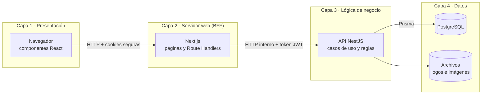
```mermaid
flowchart LR
  subgraph C1["Capa 1 · Presentación"]
    B["Navegador<br/>componentes React"]
  end
  subgraph C2["Capa 2 · Servidor web (BFF)"]
    N["Next.js<br/>páginas y Route Handlers"]
  end
  subgraph C3["Capa 3 · Lógica de negocio"]
    A["API NestJS<br/>casos de uso y reglas"]
  end
  subgraph C4["Capa 4 · Datos"]
    DB[("PostgreSQL")]
    FS[("Archivos<br/>logos e imágenes")]
  end
  B -- "HTTP + cookies seguras" --> N
  N -- "HTTP interno + token JWT" --> A
  A -- "Prisma" --> DB
  A --> FS
```

1. **Presentación.** Los componentes de React dibujan las pantallas y reciben lo que la persona escribe. No conocen la base de datos ni los tokens de sesión.
2. **Servidor web o BFF (*Backend for Frontend*).** Next.js cumple dos funciones:
   - Genera las páginas en el servidor.
   - Actúa como intermediario entre el navegador y la API. Los tokens de sesión viven en cookies `HttpOnly`, que el código del navegador no puede leer. Cada petición que modifica datos verifica que venga del propio sitio antes de reenviarla a la API con el token del usuario.
3. **Lógica de negocio.** La API de NestJS aplica las reglas del dominio: quién puede editar qué restaurante, cómo se valida un precio o cuándo se publica una carta.
4. **Datos.** PostgreSQL guarda restaurantes, cartas y estadísticas, y un volumen de archivos guarda logos e imágenes.

La consecuencia más importante es de seguridad: **el navegador nunca habla con la API ni con la base de datos**. Por ejemplo, guardar el perfil de un restaurante pasa por este *Route Handler* del BFF:

```ts
// apps/web/src/app/api/owner/restaurants/[restaurantId]/profile/route.ts
export async function PATCH(request: Request, context: { params: Promise<{ restaurantId: string }> }) {
  if (!isSameOrigin(request)) {
    return invalidOriginResponse();                 // rechaza peticiones de otros sitios
  }
  const { restaurantId } = await context.params;
  // …
  return proxyApiResponse(
    await authenticatedApiFetch(                    // añade el token de la cookie
      `/api/owner/restaurants/${encodeURIComponent(restaurantId)}/profile`,
      { body: await request.arrayBuffer(), headers: { 'content-type': contentType }, method: 'PATCH' },
      'OWNER',                                      // exige el rol de dueño
    ),
  );
}
```

### 2.2 Capas dentro de la API

Dentro de la capa de lógica de negocio, cada módulo de la API repite cuatro subcapas: `auth`, `restaurants`, `digitization`, `menu-management` y `analytics`. Siguen el estilo de **arquitectura hexagonal**, también llamada de puertos y adaptadores.

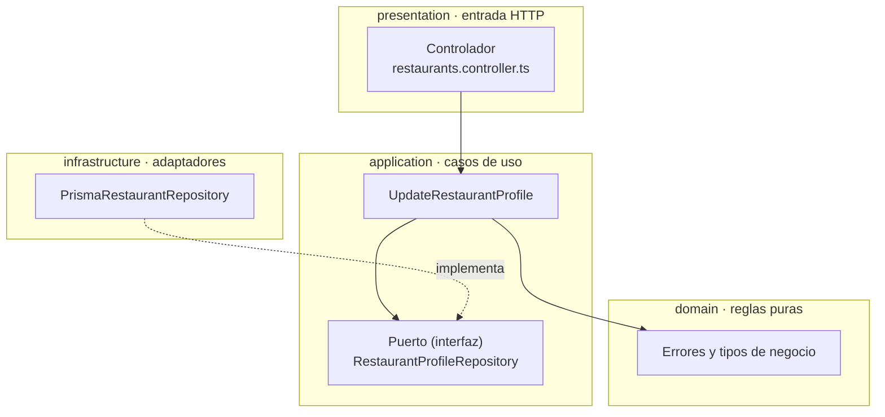
```mermaid
flowchart TB
  subgraph P["presentation · entrada HTTP"]
    CT["Controlador<br/>restaurants.controller.ts"]
  end
  subgraph AP["application · casos de uso"]
    UC["UpdateRestaurantProfile"]
    PO["Puerto (interfaz)<br/>RestaurantProfileRepository"]
  end
  subgraph D["domain · reglas puras"]
    ER["Errores y tipos de negocio"]
  end
  subgraph I["infrastructure · adaptadores"]
    RE["PrismaRestaurantRepository"]
  end
  CT --> UC
  UC --> PO
  UC --> ER
  RE -. "implementa" .-> PO
```

| Subcapa | Responsabilidad | Depende de |
|---|---|---|
| `domain` | Tipos, errores y reglas de negocio | Nada: no importa NestJS ni Prisma |
| `application` | Casos de uso y **puertos**, las interfaces de lo que necesitan | Solo de `domain` |
| `infrastructure` | **Adaptadores** concretos: Prisma, sistema de archivos, Gemini, generador de QR | Implementa los puertos |
| `presentation` | Controladores HTTP, validación de la forma de las peticiones y traducción de errores a códigos HTTP | Llama a los casos de uso |

La regla central es que **las dependencias apuntan hacia el dominio**. Un caso de uso no sabe que existe Prisma: recibe por su constructor un objeto que cumple la interfaz del puerto.

```ts
// application/ports/restaurant-profile.repository.ts — el puerto
export interface RestaurantProfileRepository {
  findProfileForOwner(ownerId: string, restaurantId: string): Promise<RestaurantProfile | null>;
  updateProfileForOwner(ownerId: string, restaurantId: string, input: UpdateRestaurantProfileRecord): Promise<RestaurantProfile | null>;
}

// application/use-cases/update-restaurant-profile.ts — el caso de uso
export class UpdateRestaurantProfile {
  constructor(
    private readonly repository: RestaurantProfileRepository,  // cualquier implementación del puerto
    private readonly storage: RestaurantLogoStorage,
  ) {}
}
```

El módulo de NestJS es el único lugar que conoce las implementaciones concretas y las conecta:

```ts
// restaurants.module.ts
{
  inject: [RESTAURANT_PROFILE_REPOSITORY, RESTAURANT_LOGO_STORAGE],
  provide: UPDATE_RESTAURANT_PROFILE,
  useFactory: (repository: RestaurantProfileRepository, storage: RestaurantLogoStorage) =>
    new UpdateRestaurantProfile(repository, storage),
},
```

Esta separación trae tres ventajas concretas:

- **Pruebas unitarias rápidas:** un caso de uso se prueba con un repositorio simulado, sin base de datos ni servidor.
- **Reemplazo de piezas:** cambiar el almacenamiento local de archivos por uno en la nube solo exige un adaptador nuevo que cumpla el mismo puerto.
- **Errores coherentes:** el dominio lanza errores con un código propio, y una única pieza de `presentation` los convierte en respuestas HTTP con un código que la interfaz traduce (sección 5.5).

### 2.3 Diagrama de componentes

Los dos diagramas anteriores muestran capas. El diagrama de componentes baja un nivel: dibuja cada módulo de la API como una pieza propia y muestra con qué se conecta cada uno.

El diagrama se generó con [Archify](https://github.com/tt-a1i/archify) y es una página HTML interactiva: [`docs/diagrams/component-diagram.html`](diagrams/component-diagram.html). Se abre en cualquier navegador sin instalar nada y permite acercar la vista, buscar un componente, resaltar sus conexiones y recorrer cuatro vistas guiadas. Su fuente es [`component-diagram.json`](diagrams/component-diagram.json). Cada componente cita el archivo del repositorio que lo implementa, y Archify comprobó que esos archivos existen en la revisión indicada antes de dibujarlo.

<!-- docx: landscape -->
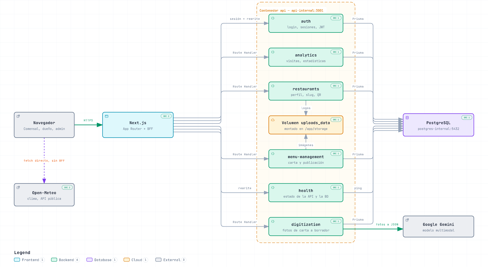

*Figura 1. Diagrama de componentes: un componente por módulo de la API, la frontera del BFF y los dos servicios externos, cada uno usado desde un lado distinto.*

| Componente | Tipo | Qué hace |
|---|---|---|
| Navegador | Externo | Lo usan el comensal, el dueño y el administrador |
| Next.js | Servidor web | Genera las páginas y hace de BFF con sus *Route Handlers* |
| `auth`, `analytics`, `restaurants`, `menu-management`, `digitization` | Módulos de dominio de la API | Siguen la arquitectura hexagonal de la sección 2.2 |
| `health` | Módulo de la API | Informa si la API y la base de datos responden |
| Volumen `uploads_data` | Almacenamiento de archivos | Guarda logos y fotos de producto |
| PostgreSQL | Base de datos | Guarda todos los datos del negocio, incluido el QR en PNG y SVG |
| Google Gemini | Servicio externo | Convierte las fotos de la carta en un borrador estructurado |
| Open-Meteo | Servicio externo | Da el clima actual de la zona del restaurante |

El diagrama deja a la vista tres decisiones:

1. **Todo el tráfico del sistema pasa por Next.js.** El archivo `next.config.ts` solo reescribe `/api/health*` y `/api/auth/*` hacia la API; cualquier otra ruta pasa por un *Route Handler* explícito que valida el origen.
2. **El volumen de archivos está dentro del contenedor de la API.** Docker Compose lo monta solo ahí (`uploads_data:/app/storage`). Únicamente `restaurants` (logos) y `menu-management` (imágenes de producto) escriben en él.
3. **Los dos servicios externos se usan desde lados opuestos.** Gemini se llama solo desde el backend, porque exige una clave secreta (`GEMINI_API_KEY`). Open-Meteo se llama directamente desde el navegador, porque es público y no necesita clave. Es la única petición del navegador que no pasa por el BFF.

---

## 3. Componentes con estado (*stateful*)

En React, un componente es **con estado** cuando guarda información propia que cambia mientras la persona interactúa (con el *hook* `useState`) y esa información decide lo que se dibuja. Si el estado cambia, React vuelve a dibujar el componente.

### 3.1 `LoginForm` — formulario de acceso

Archivo: `apps/web/src/app/login/login-form.tsx`

```tsx
export function LoginForm() {
  const router = useRouter();
  const copy = useCopy(loginCopy);
  const [failure, setFailure] = useState<LoginFailure | null>(null);   // ¿por qué falló el último intento?
  const [submitting, setSubmitting] = useState(false);                 // ¿hay una petición en curso?
  const validation = useCredentialsValidation();                       // estado de la validación (sección 6)

  async function handleSubmit(event: FormEvent<HTMLFormElement>) {
    event.preventDefault();
    // …
    if (!validation.approveSubmission(email, password)) return;
    setSubmitting(true);
    setFailure(null);
    const response = await fetch('/api/session/login', { /* … */ });
    if (!response.ok) {
      const wrongCredentials = response.status === 400 || response.status === 401;
      setFailure(wrongCredentials ? 'invalidCredentials' : 'serviceUnavailable');
      setSubmitting(false);
      return;
    }
    router.replace('/backoffice');
  }
  // …
  <Button disabled={submitting} full type="submit">
    {submitting ? copy.submitting : copy.admin.submit}
  </Button>
}
```

- `submitting` pasa a `true` al enviar: el botón se desactiva y muestra «Ingresando…», lo que evita enviar dos veces.
- `failure` recuerda el tipo de error y muestra un mensaje distinto para credenciales incorrectas o para un fallo del servicio.

El formulario del dueño, `OwnerLoginForm`, sigue exactamente el mismo diseño.

### 3.2 `PasswordField` — campo de contraseña con «Mostrar»

Archivo: `apps/web/src/components/password-field.tsx`

```tsx
export function PasswordField({ error, hint, label, ...rest }) {
  const [revealed, setRevealed] = useState(false);

  return (
    <div className="relative">
      <input type={revealed ? 'text' : 'password'} {...rest} />
      <button aria-pressed={revealed} onClick={() => setRevealed((current) => !current)} type="button">
        {revealed ? copy.hide : copy.show}
      </button>
    </div>
  );
}
```

Un único estado, `revealed`, controla tres cosas a la vez: el tipo del campo (texto oculto o visible), el texto del botón («Mostrar» / «Ocultar») y el atributo `aria-pressed` que anuncian los lectores de pantalla.

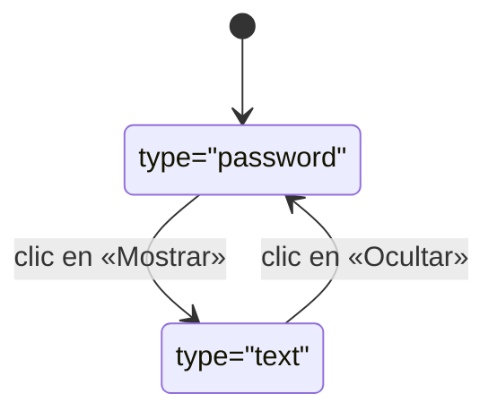
```mermaid
stateDiagram-v2
  [*] --> Oculta
  Oculta --> Visible: clic en «Mostrar»
  Visible --> Oculta: clic en «Ocultar»
  Oculta: type="password"
  Visible: type="text"
```

---

## 4. Componentes sin estado (*stateless*)

Un componente es **sin estado** cuando no guarda información propia: es una función pura de sus *props*. Con las mismas entradas dibuja siempre lo mismo, no usa `useState` ni efectos y se puede reutilizar en cualquier pantalla sin sorpresas.

### 4.1 `Card` — superficie de los paneles

Archivo: `apps/web/src/components/surfaces.tsx`

```tsx
export function Card({ accent, children, className }: CardProps) {
  return (
    <div className={cn('rounded-2xl bg-paper shadow-soft', accent && ACCENT_BORDERS[accent], className)}>
      {children}
    </div>
  );
}
```

Recibe el contenido y un color de acento opcional, y devuelve la tarjeta con el estilo del sistema de diseño. La usan el perfil, la carta, el QR, las estadísticas y el backoffice.

### 4.2 `StatusPill` — etiqueta de estado

Archivo: `apps/web/src/components/surfaces.tsx`

```tsx
export function StatusPill({ children, tone }: { children: ReactNode; tone: 'draft' | 'muted' | 'positive' }) {
  const tones = {
    draft: 'bg-copper-wash text-copper',
    muted: 'bg-control text-ink-muted',
    positive: 'bg-olive-wash text-olive',
  };
  return (
    <span className={cn('inline-flex items-center gap-1.5 rounded-full px-2 py-1 text-[11px] font-bold', tones[tone])}>
      <span aria-hidden="true" className="size-1.5 rounded-full bg-current" />
      {children}
    </span>
  );
}
```

Convierte un tono en colores. Muestra, por ejemplo, «Habilitado» / «Deshabilitado» en el backoffice y «Borrador» / «En vivo» en la carta. No decide qué estado tiene el restaurante: solo lo representa.

### 4.3 Comparación

| | Con estado (`LoginForm`, `PasswordField`) | Sin estado (`Card`, `StatusPill`) |
|---|---|---|
| Guarda información propia | Sí, con `useState` | No |
| Salida | Depende de las props **y** de lo que ocurrió antes | Depende solo de las props |
| Responsabilidad | Coordina la interacción | Presenta información |
| Cómo se prueba | Simulando clics y peticiones | Renderizando con distintas props |

La combinación de ambos es intencional. Los componentes con estado son pocos y concentran la lógica de interacción; los componentes sin estado forman la mayor parte de la interfaz, son predecibles y dan coherencia visual.

---

## 5. Internacionalización (i18n) con menú desplegable de idioma

Toda la aplicación está disponible en **español** (idioma por defecto) e **inglés**. El idioma se elige desde un menú desplegable que aparece en la página de inicio, en las dos pantallas de acceso y en el menú lateral del panel y del backoffice.

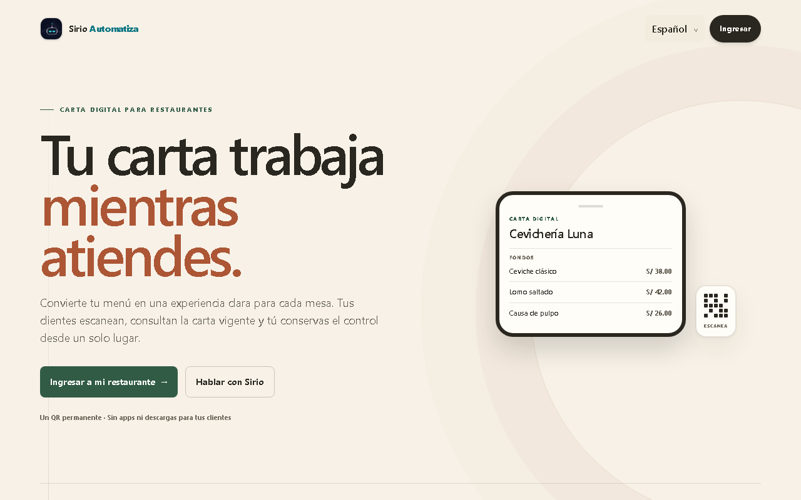

*Figura 2. Página de inicio en español; el selector «Español» está junto a la marca.*

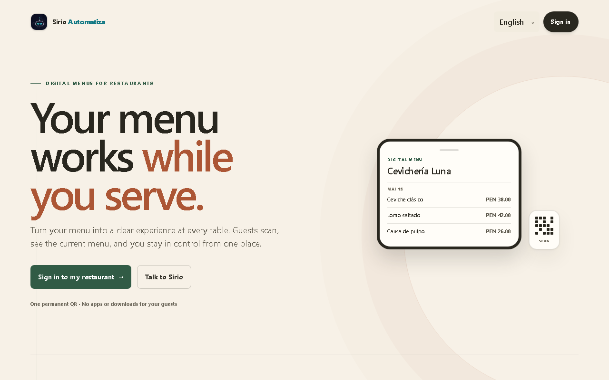

*Figura 3. La misma página tras elegir «English» en el menú desplegable.*

### 5.1 Decisiones de diseño

- **Sin dependencias externas.** Se implementó una capa propia y pequeña, con diccionarios de TypeScript, una cookie y un contexto de React, en lugar de una librería. Así se evita peso extra y se aprovecha el tipado del lenguaje.
- **Sin prefijo de idioma en la URL.** Las rutas como `/en/…` no sirven aquí, porque cada QR impreso apunta a una dirección fija `/{slug}` que no puede cambiar. El idioma se guarda en la cookie de sesión `sirio-locale`.
- **El contenido del dueño nunca se traduce.** Nombre del restaurante, platos, descripciones y dirección se muestran tal como el dueño los escribió. Solo se traduce la interfaz fija.

### 5.2 El menú desplegable

Archivo: `apps/web/src/components/language-switcher.tsx`

```tsx
const LANGUAGE_NAMES: Record<Locale, string> = { en: 'English', es: 'Español' };

export function LanguageSwitcher({ className }: { className?: string }) {
  const router = useRouter();
  const locale = useLocale();

  async function changeLanguage(event: ChangeEvent<HTMLSelectElement>) {
    const next = event.currentTarget.value;
    if (!isLocale(next)) return;
    const response = await fetch('/api/session/locale', {
      body: JSON.stringify({ locale: next }),
      headers: { 'content-type': 'application/json' },
      method: 'POST',
    }).catch(() => null);
    if (!response?.ok) return;
    startTransition(() => router.refresh());   // vuelve a pintar la página en el idioma nuevo
  }

  return (
    <select defaultValue={locale} key={locale} onChange={(event) => void changeLanguage(event)}>
      {LOCALES.map((option) => (
        <option key={option} lang={option} value={option}>{LANGUAGE_NAMES[option]}</option>
      ))}
    </select>
  );
}
```

Se usó un `<select>` nativo por accesibilidad: funciona con teclado, con lectores de pantalla y con el selector propio del teléfono sin código adicional. Cada idioma aparece escrito en sí mismo («Español», «English»), para que alguien que no entiende el idioma actual reconozca el suyo.

### 5.3 Cómo viaja el idioma por las capas

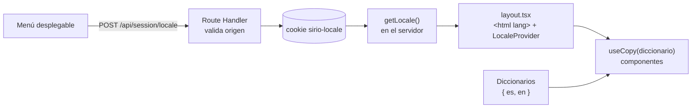
```mermaid
flowchart LR
  S["Menú desplegable"] -- "POST /api/session/locale" --> R["Route Handler<br/>valida origen"]
  R --> K[("cookie sirio-locale")]
  K --> G["getLocale()<br/>en el servidor"]
  G --> L["layout.tsx<br/>&lt;html lang&gt; + LocaleProvider"]
  L --> U["useCopy(diccionario)<br/>componentes"]
  D["Diccionarios<br/>{ es, en }"] --> U
```

1. El menú envía el idioma elegido a un *Route Handler* que valida el origen y escribe la cookie.
2. En cada petición, el servidor lee la cookie (`getLocale`), marca el documento con `<html lang="…">` y entrega el idioma a un contexto de React (`LocaleProvider`).
3. Cada componente pide el texto de su diccionario con `useCopy`:

```ts
// apps/web/src/i18n/messages/login.ts (extracto)
export const loginCopy: Record<Locale, LoginCopy> = {
  en: { invalidCredentials: 'The email or password is incorrect.', submitting: 'Signing in…', /* … */ },
  es: { invalidCredentials: 'El correo o la contraseña no son correctos.', submitting: 'Ingresando…', /* … */ },
};

// En el componente
const copy = useCopy(loginCopy);   // devuelve la versión del idioma activo
```

Como los diccionarios están tipados, olvidar una traducción es un error de compilación. Además, una prueba automática comprueba que ambos idiomas tengan exactamente las mismas entradas y que ninguna haya quedado sin traducir.

### 5.4 Formato de precios, números y fechas

Los números no se traducen: se formatean según el idioma con la API estándar `Intl` del navegador. Un mismo precio se muestra `S/ 32.00` en español y `PEN 32.00` en inglés; la moneda sigue siendo el sol peruano. Los formateadores se crean una sola vez por idioma y se reutilizan.

### 5.5 Mensajes de error de la API

Cuando la API rechaza una operación, no envía un texto fijo en un idioma, sino un **código** con sus datos, por ejemplo `{ "code": "LOGO_TOO_LARGE", "params": { "maxMb": 2 } }`. La interfaz traduce ese código al idioma activo. Así, un mismo error se lee «El logo debe pesar como máximo 2 MB.» o «The logo must be 2 MB or smaller.».

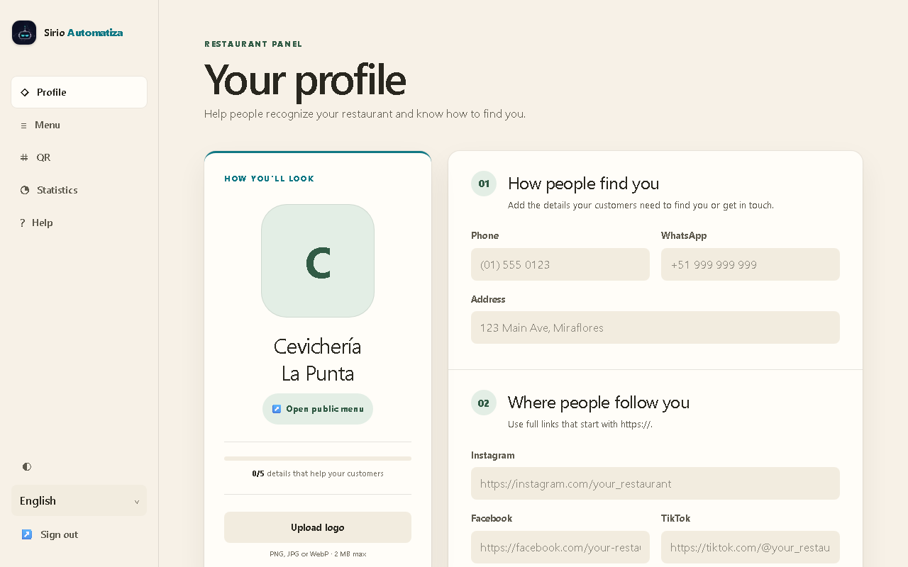

*Figura 4. Panel del dueño en inglés; el nombre del restaurante, que es contenido del dueño, no se traduce.*

---

## 6. Validación de formularios con expresiones regulares

Se validan con expresiones regulares los dos formularios de acceso: el del administrador y el del dueño. Las mismas reglas protegen la API cuando se crea o cambia una contraseña.

### 6.1 Las reglas

Archivo: `packages/shared/src/credentials-policy.ts`

```ts
const EMAIL_PATTERN = /^[^\s@]+@[^\s@]+\.[^\s@]+$/;
const PASSWORD_POLICY_PATTERN = /^(?=.*\p{Ll})(?=.*\p{Lu})(?=.*\p{Nd})/su;

export function isValidEmailFormat(value: string): boolean {
  return EMAIL_PATTERN.test(value);
}

export function meetsPasswordPolicy(value: string): boolean {
  return value.length >= 8 && value.length <= 128 && PASSWORD_POLICY_PATTERN.test(value);
}
```

**Correo electrónico** (`EMAIL_PATTERN`):

| Parte | Significado |
|---|---|
| `^` y `$` | La regla se aplica al texto completo, de principio a fin |
| `[^\s@]+` | Uno o más caracteres que no sean espacios ni `@` (la parte antes de la arroba) |
| `@` | Exactamente una arroba |
| `[^\s@]+` | El nombre del dominio |
| `\.[^\s@]+` | Un punto y la extensión (`.pe`, `.com`) |

Acepta `hola@turestaurante.pe` y rechaza `hola@turestaurante` (sin extensión), `hola mundo@correo.com` (con espacio) o `@correo.com` (sin nombre).

**Contraseña** (`PASSWORD_POLICY_PATTERN`). Usa *lookaheads*, o búsquedas anticipadas: comprueban que algo aparezca en algún lugar del texto sin consumirlo, y por eso admiten cualquier orden.

| Parte | Significado |
|---|---|
| `(?=.*\p{Ll})` | Hay al menos una letra minúscula |
| `(?=.*\p{Lu})` | Hay al menos una letra mayúscula |
| `(?=.*\p{Nd})` | Hay al menos un dígito |
| flag `u` | Activa las clases Unicode `\p{…}`, que reconocen letras con tilde como `Ñ` o `É` |
| flag `s` | Permite que `.` también cruce saltos de línea |

La longitud, entre 8 y 128 caracteres, se comprueba aparte en la misma función. Así, `Ñandú2024` es válida porque su única mayúscula es la `Ñ`, y `clavedebil` no, porque le faltan la mayúscula y el número.

### 6.2 Una sola regla para el cliente y el servidor

Las expresiones regulares viven en el paquete compartido `@sirio/shared`, que importan tanto la web como la API:

- **Web:** los formularios de acceso muestran avisos antes de enviar.
- **API:** al dar de alta un restaurante o cambiar una contraseña se exige la misma regla.

Tener una sola fuente evita que el navegador acepte algo que el servidor rechaza, o al revés.

### 6.3 Comportamiento en el formulario

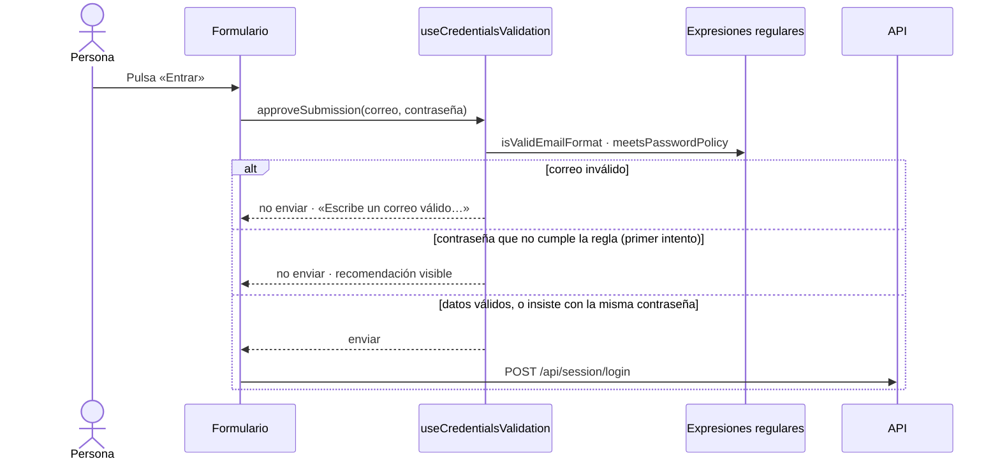
```mermaid
sequenceDiagram
  actor P as Persona
  participant F as Formulario
  participant V as useCredentialsValidation
  participant R as Expresiones regulares
  participant A as API
  P->>F: Pulsa «Entrar»
  F->>V: approveSubmission(correo, contraseña)
  V->>R: isValidEmailFormat · meetsPasswordPolicy
  alt correo inválido
    V-->>F: no enviar · «Escribe un correo válido…»
  else contraseña que no cumple la regla (primer intento)
    V-->>F: no enviar · recomendación visible
  else datos válidos, o insiste con la misma contraseña
    V-->>F: enviar
    F->>A: POST /api/session/login
  end
```

Archivo: `apps/web/src/lib/use-credentials-validation.ts`

```ts
function approveSubmission(email: string, password: string): boolean {
  const emailProblem = emailFormatError(email);           // aplica EMAIL_PATTERN
  const passwordProblem = passwordRequiredError(password);
  const hint = passwordPolicyHint(password);              // aplica PASSWORD_POLICY_PATTERN
  setEmailError(emailProblem);
  setPasswordError(passwordProblem);
  setPasswordHint(hint);
  if (emailProblem || passwordProblem) return false;      // el correo inválido bloquea
  if (hint && acknowledgedPassword !== password) {        // la contraseña débil solo advierte
    setAcknowledgedPassword(password);
    return false;
  }
  return true;
}
```

El formulario trata distinto las dos reglas:

- **Correo inválido: bloquea el envío.** No existe ninguna cuenta con un correo mal formado, así que enviarlo no tiene sentido.
- **Contraseña débil: solo advierte.** Las cuentas creadas antes de esta regla pueden tener contraseñas que no la cumplen. Bloquearlas impediría a sus dueños entrar, así que el formulario muestra la recomendación y deja continuar si la persona vuelve a pulsar «Entrar».

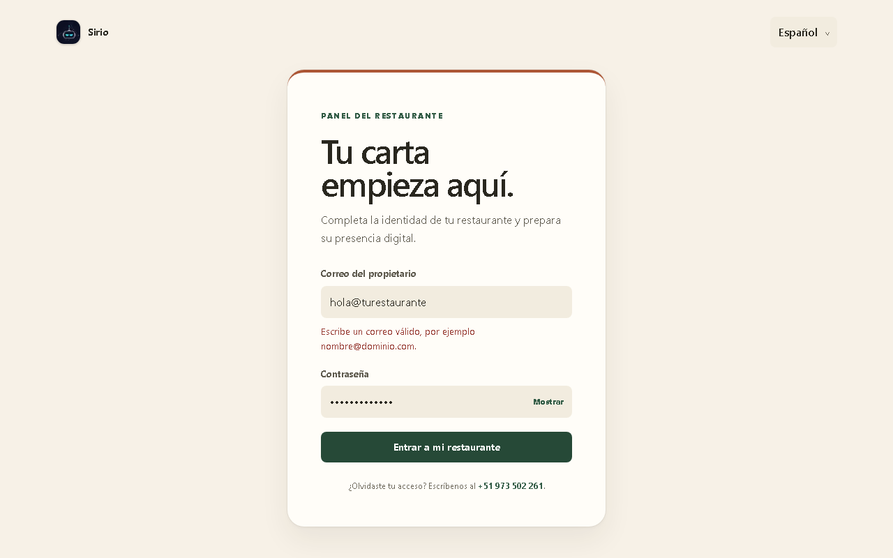

*Figura 5. El correo `hola@turestaurante` no cumple la expresión regular y el formulario no se envía.*

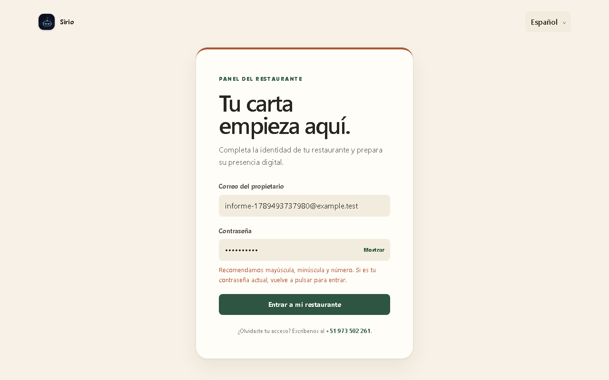

*Figura 6. La contraseña no tiene mayúscula ni número: el formulario lo recomienda, pero permite continuar.*

Los mensajes también están traducidos: la validación devuelve una clave, como `emailFormat`, y el diccionario del idioma activo la convierte en texto. El formulario usa además el atributo `noValidate`, para que los globos nativos del navegador no se adelanten a los mensajes de estas reglas.

---

## 7. Consumo de un servicio externo desde el frontend

El perfil del dueño muestra ahora una tarjeta **«Clima ahora»** con el tiempo actual en la zona del restaurante. Le sirve para anticipar el día: con calor se venden más bebidas frías; con lluvia, más pedidos para llevar.

Los datos vienen de [Open-Meteo](https://open-meteo.com/), un servicio meteorológico público. Se usan dos de sus APIs:

| API | Para qué | Ejemplo de respuesta |
|---|---|---|
| Geocoding API | Convierte el nombre de un lugar en coordenadas | `Miraflores, Lima` → latitud −12,11, longitud −77,03, región «Departamento de Lima» |
| Forecast API | Devuelve el tiempo actual en esas coordenadas | 22 °C, código WMO 3 (nublado), medido a las 08:30 hora local |

### 7.1 Por qué la llamada sale del navegador

El resto de la aplicación nunca habla con un servidor ajeno desde el navegador: todo pasa por el BFF (sección 2.1). Esa regla existe para proteger los tokens de sesión y la API interna. Open-Meteo no necesita ninguna de las dos cosas:

- **No pide clave.** No hay ningún secreto que esconder en el servidor.
- **No recibe datos privados.** Solo viaja el nombre de una ciudad.
- **Acepta peticiones de cualquier sitio.** Responde con la cabecera CORS `access-control-allow-origin: *`, así que el navegador permite leer la respuesta.

Pasar la llamada por el BFF solo añadiría un salto y carga al servidor. Por eso es la única excepción a la regla, y está documentada en el README.

El caso contrario es Google Gemini, que digitaliza las cartas: exige una clave secreta (`GEMINI_API_KEY`), así que solo se llama desde la API. El diagrama de componentes (figura 1) muestra ambos servicios, cada uno conectado desde un lado distinto.

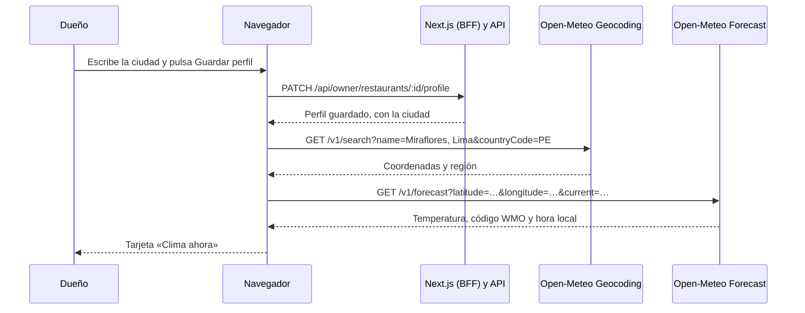
```mermaid
sequenceDiagram
  participant D as Dueño
  participant N as Navegador
  participant B as Next.js (BFF) y API
  participant G as Open-Meteo Geocoding
  participant F as Open-Meteo Forecast
  D->>N: Escribe la ciudad y pulsa Guardar perfil
  N->>B: PATCH /api/owner/restaurants/:id/profile
  B-->>N: Perfil guardado, con la ciudad
  N->>G: GET /v1/search?name=Miraflores, Lima&countryCode=PE
  G-->>N: Coordenadas y región
  N->>F: GET /v1/forecast?latitude=…&longitude=…&current=…
  F-->>N: Temperatura, código WMO y hora local
  N-->>D: Tarjeta «Clima ahora»
```

### 7.2 Un campo nuevo: la ciudad

La primera idea fue geocodificar la dirección que el dueño ya había guardado. Al probarlo contra la API real no funcionó: la geocodificación solo entiende **nombres de lugares o códigos postales**, no calles.

| Texto buscado | Resultado |
|---|---|
| `Av. Larco 123, Miraflores, Lima` | Ningún resultado |
| `Lima` | Lima, Provincia de Lima (correcto) |
| `Miraflores, Lima` | Miraflores, Departamento de Lima (correcto) |
| `Barranco` | Un pueblo de Cajamarca: ese distrito de Lima no está en la base de Open-Meteo |

Por eso el perfil tiene ahora un campo **Ciudad**. Se guarda en la columna nueva `Restaurant.city`, opcional y de hasta 120 caracteres, y la API la valida con la misma función que al resto del perfil (`normalizeRestaurantProfile`, en la capa `application`). La carta pública también la muestra, a continuación de la dirección: «Malecón de la Reserva 610 · Miraflores, Lima».

### 7.3 El cliente de Open-Meteo

Toda la comunicación con el servicio está en un único módulo, [`apps/web/src/lib/weather.ts`](../apps/web/src/lib/weather.ts). Son funciones sin estado: reciben datos y devuelven datos, así que se prueban sin montar ningún componente.

```ts
// apps/web/src/lib/weather.ts
const GEOCODING_URL = 'https://geocoding-api.open-meteo.com/v1/search';
const COUNTRY_CODE = 'PE';

export function geocodingUrl(city: string, locale: Locale): string {
  const query = new URLSearchParams({
    count: '1',
    countryCode: COUNTRY_CODE,
    format: 'json',
    language: locale,
    name: city,
  });
  return `${GEOCODING_URL}?${query.toString()}`;
}

export async function lookUpWeather(
  city: string,
  locale: Locale,
  signal?: AbortSignal,
): Promise<WeatherLookup> {
  const place = parsePlace(await requestJson(geocodingUrl(city, locale), signal));
  if (!place) return { kind: 'not-found' };
  const unit = temperatureUnit(locale); // °C en español, °F en inglés
  const weather = parseCurrentWeather(
    await requestJson(forecastUrl(place, unit), signal),
    unit,
  );
  return { kind: 'found', region: place.region, weather };
}

async function requestJson(url: string, signal?: AbortSignal): Promise<unknown> {
  const response = await fetch(url, { signal }); // fetch del navegador, sin /api
  if (!response.ok) {
    throw new WeatherUnavailableError(`Open-Meteo answered ${response.status}`);
  }
  return response.json();
}
```

Tres decisiones del módulo:

1. **La respuesta de un tercero no se da por buena.** `parsePlace` y `parseCurrentWeather` comprueban cada campo antes de usarlo, por ejemplo que la temperatura sea un número. Si la forma no es la esperada, lanzan un error propio en lugar de dibujar datos rotos.
2. **La búsqueda se limita a Perú.** Sin el filtro, «San Miguel» devuelve primero San Miguelito, en Panamá.
3. **Los códigos del tiempo se traducen.** Open-Meteo devuelve códigos WMO (0 = despejado, 3 = nublado, 61 = lluvia…). `weatherCondition` los agrupa en 15 condiciones con texto en español y en inglés.

### 7.4 La tarjeta «Clima ahora»

La tarjeta es un componente de cliente con estado. El hook `useRestaurantWeather` pide el clima cuando cambia la ciudad guardada o el idioma, y cancela la petición anterior si el dueño cambia de ciudad antes de recibir la respuesta:

```tsx
// apps/web/src/app/admin/restaurant-weather.tsx
export function useRestaurantWeather(savedCity: string | null): WeatherState {
  const locale = useLocale();
  const city = savedCity?.trim() ?? '';
  const key = `${locale}\n${city}`;
  const [result, setResult] =
    useState<{ key: string; state: WeatherState } | null>(null);

  useEffect(() => {
    if (!city) return;
    const controller = new AbortController();
    lookUpWeather(city, locale, controller.signal).then(
      (lookup) =>
        setResult({
          key,
          state:
            lookup.kind === 'found'
              ? { region: lookup.region, status: 'ready', weather: lookup.weather }
              : { status: 'not-found' },
        }),
      () => {
        if (!controller.signal.aborted) {
          setResult({ key, state: { status: 'error' } });
        }
      },
    );
    return () => controller.abort(); // cancela la consulta anterior
  }, [city, key, locale]);

  if (!city) return { status: 'idle' };
  return result?.key === key ? result.state : { status: 'loading' };
}
```

El hook vive en el panel del perfil y no dentro del formulario. El formulario se vuelve a montar cada vez que se guarda, y si el hook estuviera dentro, guardar el teléfono volvería a consultar el clima. Una prueba lo impide: guardar sin cambiar la ciudad no genera peticiones nuevas.

| Estado | Qué ve el dueño |
|---|---|
| Sin ciudad | «Agrega la ciudad de tu local para ver el clima de tu zona.» |
| Consultando | «Consultando el clima…» |
| Ciudad no encontrada | «No encontramos «X». Prueba solo con el distrito o la ciudad.» |
| Error de red | «No pudimos cargar el clima. Inténtalo más tarde.» El resto del perfil sigue funcionando. |
| Listo | Temperatura, estado del cielo, ciudad y región encontrada, hora de la medición y el enlace a Open-Meteo |

La tarjeta muestra la región que devolvió Open-Meteo junto a la ciudad guardada. Así, si la API elige un lugar equivocado (el caso de Barranco), el dueño lo ve y puede corregir la ciudad. El enlace «Weather data by Open-Meteo.com» lo exige la licencia CC BY 4.0 de los datos.

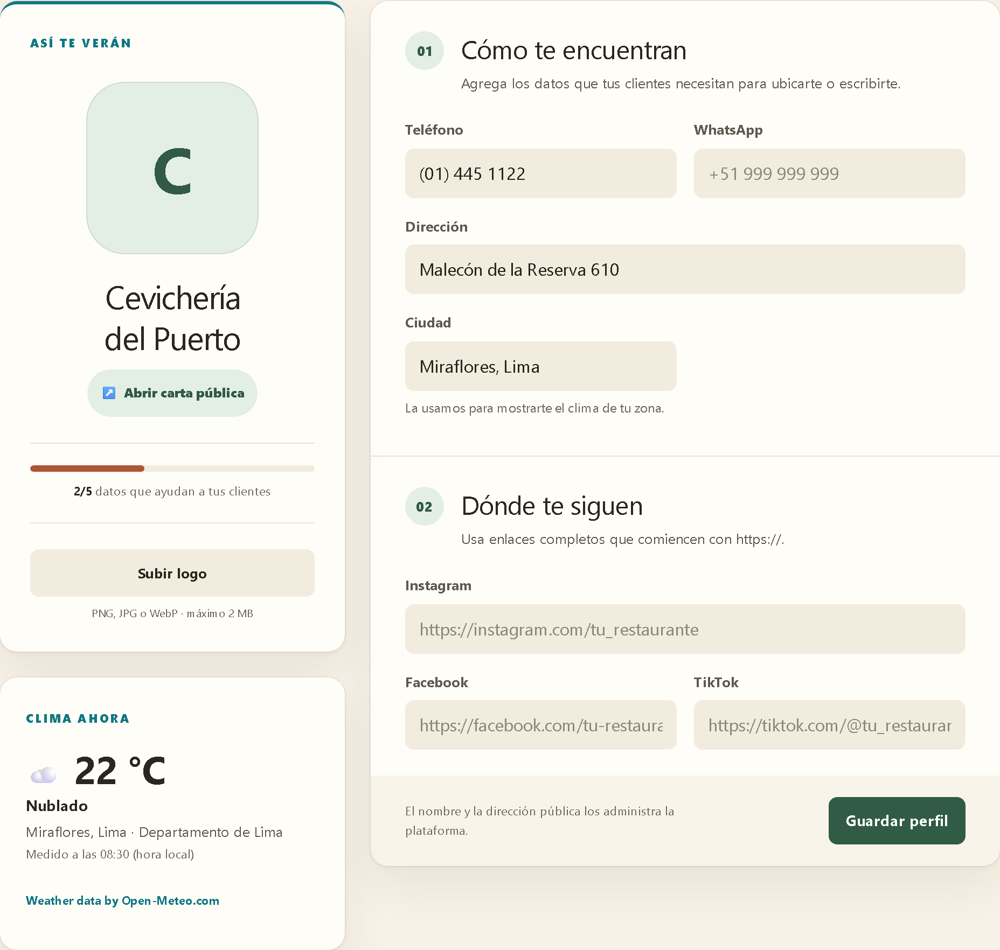

*Figura 7. Perfil del dueño con la ciudad «Miraflores, Lima» y la tarjeta «Clima ahora» con datos reales de Open-Meteo.*

### 7.5 Evidencia de que la petición la hace el navegador

La figura 8 es la pestaña Network del visor de trazas de Playwright, grabada en la misma sesión de la figura 7. Filtrada por «open-meteo», muestra las dos peticiones (`search` y `forecast`) y el detalle de la primera.

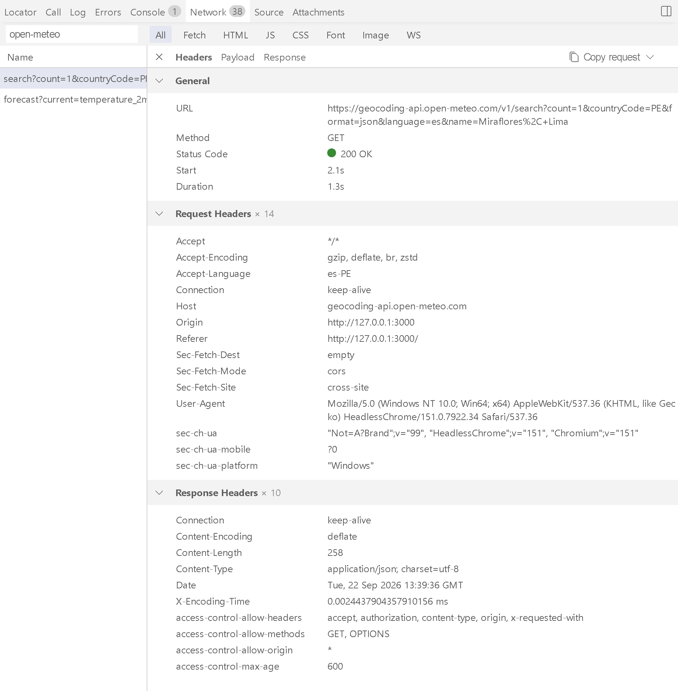

*Figura 8. Petición del navegador a la Geocoding API de Open-Meteo, con sus cabeceras de petición y de respuesta.*

Las cabeceras prueban el origen de la llamada:

- `Origin: http://127.0.0.1:3000`: la petición la inició la página web de Sirio, no el servidor.
- `Sec-Fetch-Mode: cors` y `Sec-Fetch-Site: cross-site`: el navegador la trató como una petición entre sitios distintos.
- `access-control-allow-origin: *` en la respuesta: Open-Meteo autoriza que cualquier página lea el resultado.

La prueba E2E [`owner-weather.spec.ts`](../tests/e2e/owner-weather.spec.ts) comprueba lo mismo de forma automática. Intercepta Open-Meteo con `page.route`, que solo ve las peticiones del navegador: si la llamada saliera del servidor Next.js, la prueba fallaría. Además verifica que la petición sea de tipo `fetch` y venga de la página.

### 7.6 Pruebas

| Prueba | Qué comprueba |
|---|---|
| `lib/weather.test.ts` (14 casos) | URLs y parámetros, validación de respuestas, códigos WMO, «no encontrada», errores HTTP y cancelación |
| `restaurant-weather.test.tsx` (6 casos) | Cada estado de la tarjeta, °F en inglés, hora en 24 h y nueva consulta al cambiar de ciudad |
| `restaurant-profile-panel.test.tsx` (2 casos nuevos) | El campo Ciudad, y que guardar sin cambiar la ciudad no repite la consulta |
| `owner-weather.spec.ts` (3 escenarios en 3 navegadores) | Guardado de la ciudad, clima en español e inglés, ciudad desconocida, corte de red y ciudad en la carta pública |

### 7.7 Limitaciones

- **Distritos que no existen en la base.** Barranco y San Miguel (Lima) se resuelven a pueblos homónimos de otras regiones. La región visible en la tarjeta deja ver el error.
- **Uso comercial.** El plan gratuito de Open-Meteo es solo para uso no comercial, hasta 10 000 llamadas al día. Antes de cobrar a los restaurantes hay que contratar una clave comercial.

---

## 8. Conclusiones

- **Arquitectura en n capas.** Se aplicó en dos niveles: el sistema se divide en presentación, servidor web (BFF), lógica de negocio y datos, y cada módulo de la API separa dominio, aplicación, infraestructura y presentación. Esto aísla la seguridad de la sesión en el servidor web y permite probar cada caso de uso sin base de datos. El diagrama de componentes, generado con Archify a partir del código real, muestra cada módulo y sus conexiones.
- **Componentes con y sin estado.** `LoginForm` y `PasswordField` concentran la interacción mediante `useState`; `Card` y `StatusPill` son funciones puras de sus props que dan coherencia visual en toda la aplicación.
- **Internacionalización.** Español e inglés conviven sin librerías externas, gracias a diccionarios tipados, una cookie de sesión y un menú desplegable accesible. Se respetan dos restricciones reales del producto: la URL fija de cada QR y el contenido escrito por el dueño.
- **Expresiones regulares.** Las reglas de correo y contraseña se definen una sola vez y se aplican en la web y en la API. Cada regla tiene un comportamiento diferenciado: el correo inválido se bloquea y la contraseña débil solo se advierte, para no dejar fuera a ningún usuario existente.
- **Servicio externo desde el frontend.** El navegador consulta directamente a Open-Meteo para mostrar el clima de la zona del restaurante. Es la única excepción a la regla del BFF, y está justificada: el servicio es público, no pide clave y no recibe datos privados. Las respuestas del tercero se validan antes de usarse, y un fallo del servicio solo afecta a su tarjeta.

Las rutas y líneas exactas de cada fragmento citado, y las pruebas que lo verifican, están en [`checklist-academico.md`](checklist-academico.md).
