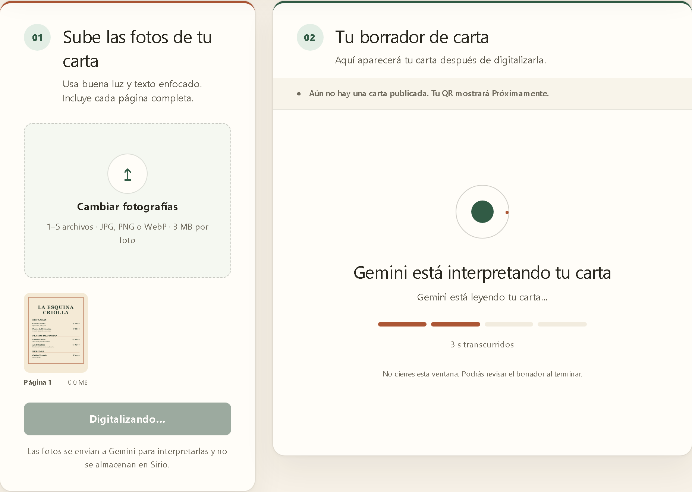
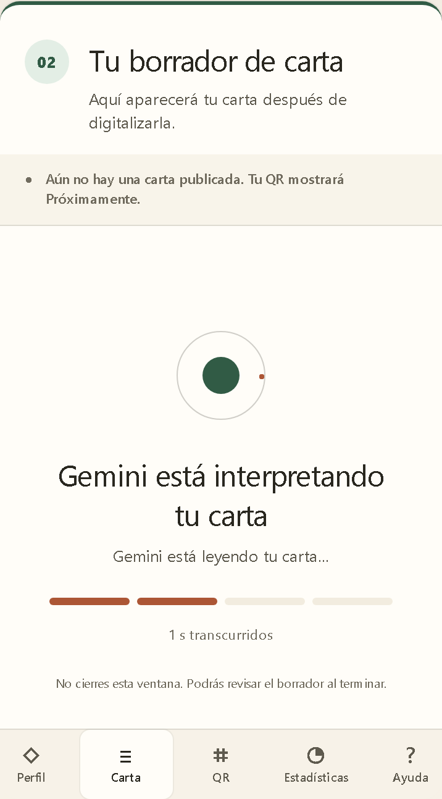
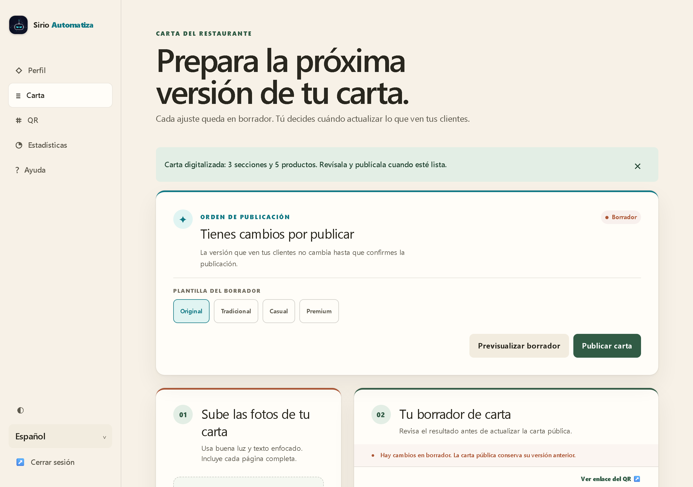
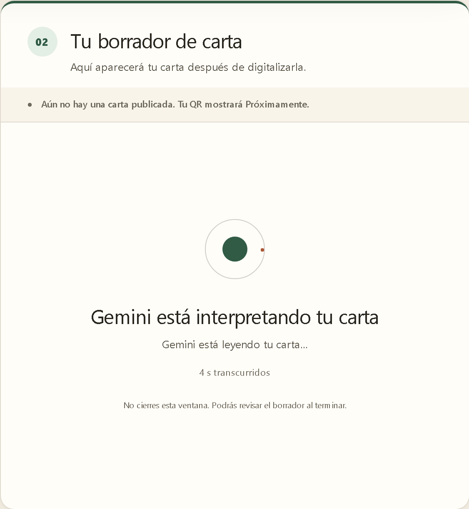
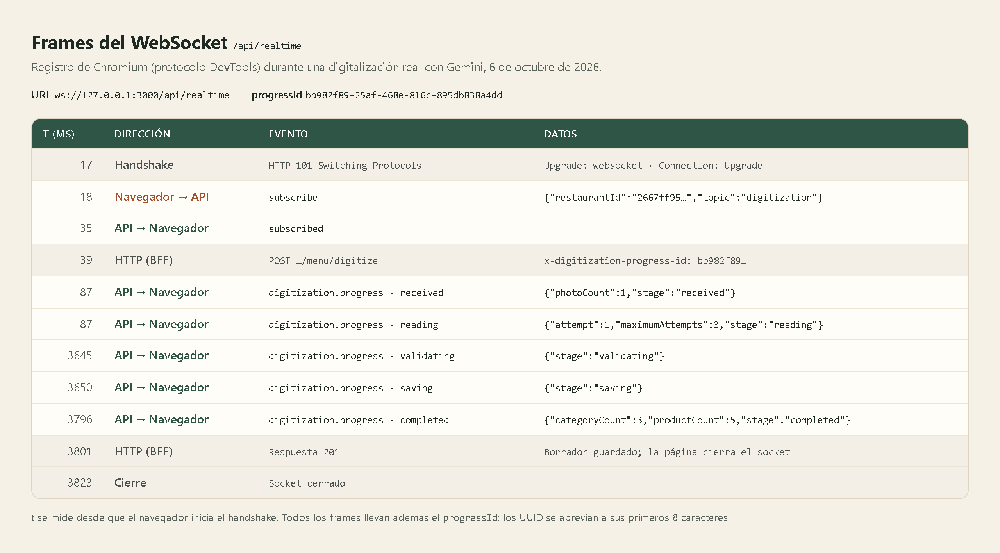

# Informe: WebSocket en el Sistema de Cartas QR

Anexo del [informe de implementación](informe.md). Explica dónde y cómo el sistema usa un WebSocket, y reúne la evidencia de que funciona.

---

## 1. Resumen

El dueño digitaliza su carta enviando fotos a Gemini desde `/admin/menu`. La petición tarda varios segundos y, si Gemini falla y se reintenta, puede alargarse varios minutos (hasta tres intentos de 60 s cada uno). Antes, la pantalla avanzaba cuatro etapas con un temporizador fijo de 5 s que no sabía qué pasaba en el servidor.

Ahora la API informa cada etapa real por un **WebSocket** (`/api/realtime`): fotos recibidas, Gemini leyendo (con el número de intento), reintento, validación, guardado y resultado. La pantalla muestra exactamente esas etapas, el tiempo transcurrido y, al terminar, cuántas secciones y productos se detectaron.

El WebSocket solo informa. La petición HTTP sigue decidiendo el resultado: si el socket no conecta, la digitalización funciona igual y la pantalla muestra una línea genérica, nunca etapas inventadas.

## 2. Dónde se agregó

| Capa | Archivo | Qué hace |
|---|---|---|
| Protocolo compartido | [`packages/shared/src/realtime.ts`](../packages/shared/src/realtime.ts#L5) | Ruta `/api/realtime`, códigos de cierre, mensajes y el tipo [`DigitizationProgress`](../packages/shared/src/realtime.ts#L37); lo usan la API y la web |
| API · gateway | [`realtime.gateway.ts`](../apps/api/src/realtime/presentation/realtime.gateway.ts#L53) | Servidor WebSocket: valida el handshake ([L76](../apps/api/src/realtime/presentation/realtime.gateway.ts#L76)), atiende `subscribe` ([L100](../apps/api/src/realtime/presentation/realtime.gateway.ts#L100)) y hace ping o cierra conexiones ([L136](../apps/api/src/realtime/presentation/realtime.gateway.ts#L136)) |
| API · reglas del handshake | [`realtime-protocol.ts`](../apps/api/src/realtime/presentation/realtime-protocol.ts#L27) | Lectura de la cookie, verificación del `Origin` y validación de la suscripción |
| API · suscripciones | [`subscription-hub.ts`](../apps/api/src/realtime/application/subscription-hub.ts#L16) | Registro en memoria de qué socket escucha qué digitalización |
| API · arranque | [`main.ts`](../apps/api/src/main.ts#L32) y [`realtime.module.ts`](../apps/api/src/realtime/realtime.module.ts#L31) | Activa el adaptador `ws` de NestJS y registra el módulo |
| API · caso de uso | [`digitize-menu.ts`](../apps/api/src/digitization/application/use-cases/digitize-menu.ts#L38) | Publica cada etapa a través del puerto [`DigitizationProgressReporter`](../apps/api/src/digitization/application/ports/digitization-progress.reporter.ts#L9) |
| API · Gemini | [`gemini-menu-extraction.gateway.ts`](../apps/api/src/digitization/infrastructure/gemini-menu-extraction.gateway.ts#L73) | Avisa al empezar cada intento y antes de cada reintento |
| API · adaptador | [`realtime-progress.reporter.ts`](../apps/api/src/digitization/infrastructure/realtime-progress.reporter.ts#L11) | Implementa el puerto enviando las etapas por el WebSocket |
| API · controlador | [`digitization.controller.ts`](../apps/api/src/digitization/digitization.controller.ts#L76) | Lee la cabecera `x-digitization-progress-id` que une la petición con la suscripción |
| Web · proxy | [`next.config.ts`](../apps/web/next.config.ts#L41) | `rewrite` de `/api/realtime` hacia NestJS: Next.js reenvía el upgrade del WebSocket |
| Web · BFF | [`digitize/route.ts`](../apps/web/src/app/api/owner/restaurants/[restaurantId]/menu/digitize/route.ts#L42) | Reenvía la cabecera de progreso a la API |
| Web · cliente | [`use-digitization-progress.ts`](../apps/web/src/app/admin/menu/use-digitization-progress.ts#L30) | Hook que abre el socket ([L46](../apps/web/src/app/admin/menu/use-digitization-progress.ts#L46)), se suscribe y entrega las etapas |
| Web · pantalla | [`menu-digitizer.tsx`](../apps/web/src/app/admin/menu/menu-digitizer.tsx#L166) | Se suscribe antes de enviar las fotos y pinta el panel [`ProcessingState`](../apps/web/src/app/admin/menu/menu-digitizer.tsx#L454) |
| Infraestructura | [`docker/nginx.conf`](../docker/nginx.conf#L8) | Conserva las cabeceras `Upgrade` y `Connection` ([L40](../docker/nginx.conf#L40)) |

El módulo de digitalización sigue la arquitectura hexagonal del resto de la API: el caso de uso solo conoce el puerto `DigitizationProgressReporter`, y es el adaptador el que sabe que existe un WebSocket. Por eso el caso de uso se prueba sin levantar NestJS ni abrir sockets.

## 3. Cómo funciona

1. El dueño pulsa «Digitalizar en borrador». La página genera un identificador aleatorio (`progressId`) y abre `ws://<origen>/api/realtime` (`wss://` en producción).
2. El navegador solo habla con Next.js. Next.js reenvía la conexión a NestJS mediante un `rewrite`, igual que hace con `/api/auth/*`; en producción, nginx deja pasar el cambio de protocolo.
3. NestJS acepta el handshake solo si el `Origin` es el de la aplicación, si trae la cookie de sesión `sirio_access` y si la sesión es de un dueño. Si no, cierra con `4403` (origen) o `4401` (sesión). Si la sesión caducó, la página la renueva una vez y vuelve a intentarlo.
4. La página envía `subscribe` con el restaurante y el `progressId`. La API comprueba que el restaurante pertenezca a ese dueño y responde `subscribed`.
5. Solo entonces la página envía las fotos por HTTP con la cabecera `x-digitization-progress-id`, así que ninguna etapa se publica antes de que alguien escuche.
6. Mientras trabaja, `DigitizeMenu` publica `digitization.progress` con cada etapa:

| Etapa | Cuándo | Lo que ve el dueño |
|---|---|---|
| `received` | Fotos validadas | «Foto recibida y validada.» |
| `reading` | Empieza un intento contra Gemini | «Gemini está leyendo tu carta…» (con «intento 2 de 3» si es un reintento) |
| `retrying` | El intento falló | «Gemini no respondió. Reintentando (intento 2 de 3)…» |
| `validating` | Gemini respondió | «Validando secciones, platos y precios…» |
| `saving` | Se guarda el borrador | «Guardando el borrador…» |
| `completed` | Borrador guardado | «Borrador listo: 3 secciones y 5 productos.» |
| `failed` | Algo falló tras recibir las fotos | El mismo código de error de la respuesta HTTP |

7. Llega la respuesta HTTP con el borrador, la página muestra el resumen y cierra el socket.

## 4. Seguridad y límites

- **Misma frontera que el resto de la aplicación.** El navegador nunca se conecta directamente a NestJS: entra por Next.js, como todas las demás peticiones.
- **El token no se expone.** La cookie es `HttpOnly`: el navegador la envía en el handshake, pero el código de la página no puede leerla.
- **Solo tu restaurante.** Suscribirse al restaurante de otro dueño responde `ACCESS_DENIED`; es la misma defensa contra IDOR que protege las rutas HTTP.
- **Otro sitio no puede usar tu sesión.** Una página de otro dominio envía su propio `Origin` y se cierra con `4403`, aunque la cookie viaje.
- **Límites:** 4 suscripciones por conexión, mensajes de hasta 4 KB, un ping cada 20 s que cierra los sockets que no responden y un cierre forzado (`4408`) a los 5 minutos.
- **Informar nunca rompe la digitalización.** Si enviar una etapa falla, se registra en el log y la digitalización continúa.

## 5. Evidencia

Las capturas se tomaron con un script de Playwright contra el stack completo de Docker Compose (PostgreSQL, NestJS, Next.js y nginx), con digitalizaciones reales en Gemini de una carta de prueba de tres secciones y cinco productos.



*Figura 1. Escritorio (1280 px): la etapa real «Gemini está leyendo tu carta…», dos de los cuatro tramos de la barra y el tiempo transcurrido, junto a la foto enviada.*



*Figura 2. El mismo panel en un móvil (390 px).*



*Figura 3. Al terminar, el aviso resume lo que detectó Gemini: «3 secciones y 5 productos», los mismos números que envió la etapa `completed`.*



*Figura 4. Sin WebSocket: una sola línea genérica, sin barra. Para provocarlo, el script rechazó la conexión con `page.routeWebSocket` y retuvo la petición unos segundos para poder tomar la imagen; la digitalización terminó con normalidad.*



*Figura 5. Frames reales de la digitalización de la figura 1, registrados por Chromium mediante el protocolo DevTools. La tabla es la presentación de esos datos: handshake `101`, suscripción a los 35 ms, petición HTTP a los 39 ms con el mismo `progressId` y las etapas hasta `completed` a los 3,8 s.*

## 6. Pruebas

| Prueba | Qué verifica |
|---|---|
| [`realtime.gateway.spec.ts`](../apps/api/src/realtime/presentation/realtime.gateway.spec.ts) | Rechazo por origen, sin cookie, token inválido o rol administrador; suscripción a un restaurante propio y ajeno; límite de suscripciones; ping y cierre por antigüedad |
| [`realtime-protocol.spec.ts`](../apps/api/src/realtime/presentation/realtime-protocol.spec.ts) y [`subscription-hub.spec.ts`](../apps/api/src/realtime/application/subscription-hub.spec.ts) | Lectura de la cookie, `Origin` permitido, mensajes válidos y entrega solo a quien está suscrito |
| [`digitize-menu.spec.ts`](../apps/api/src/digitization/application/use-cases/digitize-menu.spec.ts) | Orden de las etapas con un reintento, etapa `failed` con el código HTTP y ningún evento si nadie se suscribió |
| [`menu-digitizer.test.tsx`](../apps/web/src/app/admin/menu/menu-digitizer.test.tsx) | La pantalla muestra cada etapa recibida, ignora las de otra digitalización, cae a la línea genérica sin socket y renueva una sesión caducada |
| [`realtime-websocket.spec.ts`](../tests/e2e/realtime-websocket.spec.ts#L89) (E2E) | Contra el stack real: el socket pasa por Next.js, se suscribe, rechaza el restaurante ajeno y cierra con `4401` y `4403` |
| [`phase-four-menu-digitization.spec.ts`](../tests/e2e/phase-four-menu-digitization.spec.ts#L120) (E2E) | Con Gemini real: los frames llegan en orden `received → reading → validating → saving → completed` y el resumen coincide con lo reportado |

```powershell
pnpm --filter @sirio/api exec jest src/realtime src/digitization
pnpm --filter @sirio/web exec jest src/app/admin/menu
pnpm exec playwright test tests/e2e/realtime-websocket.spec.ts tests/e2e/phase-four-menu-digitization.spec.ts --project=desktop-chromium
```

Las pruebas E2E necesitan el stack levantado (`pnpm compose:dev`).

## 7. Conclusión

El WebSocket resuelve un problema concreto: el dueño ve lo que realmente ocurre mientras Gemini lee su carta, en lugar de una animación con tiempos fijos. Se integró sin romper la regla de que el navegador solo habla con Next.js, reutiliza la sesión y la defensa contra IDOR existentes, y no hace que la digitalización dependa de él.
